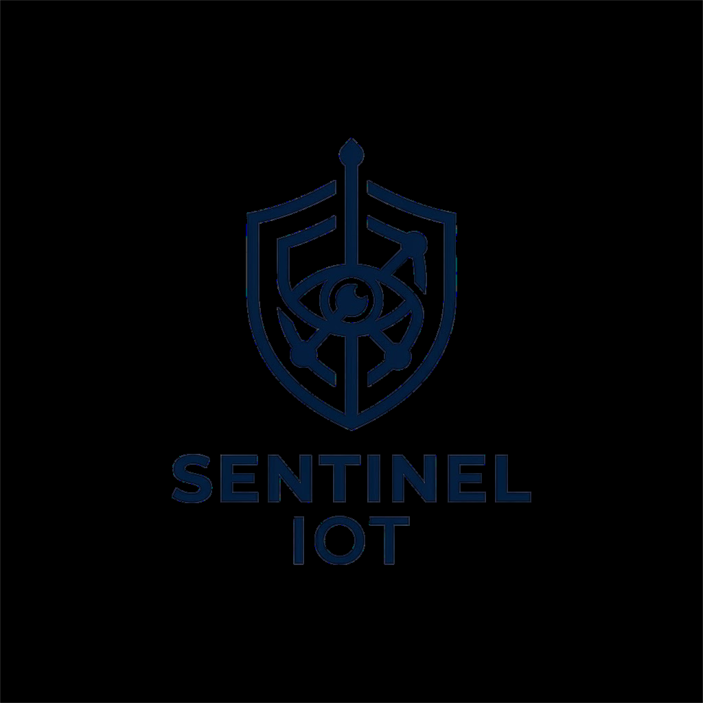
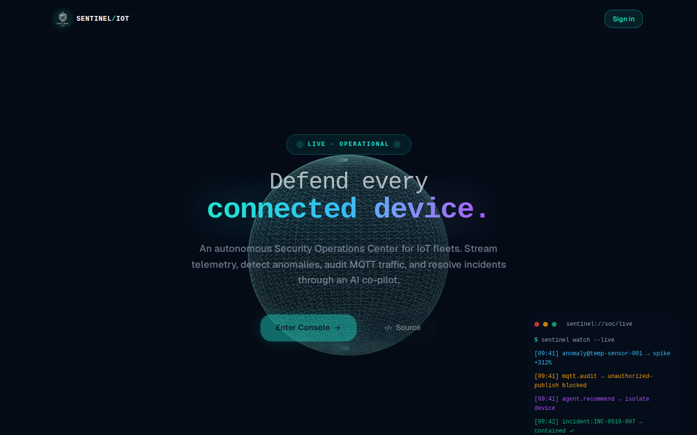
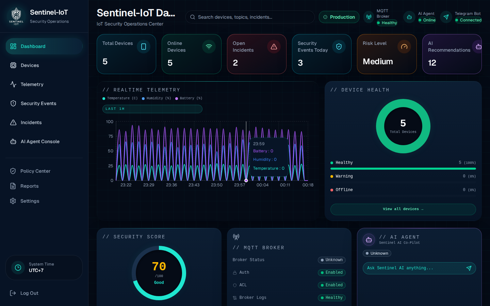
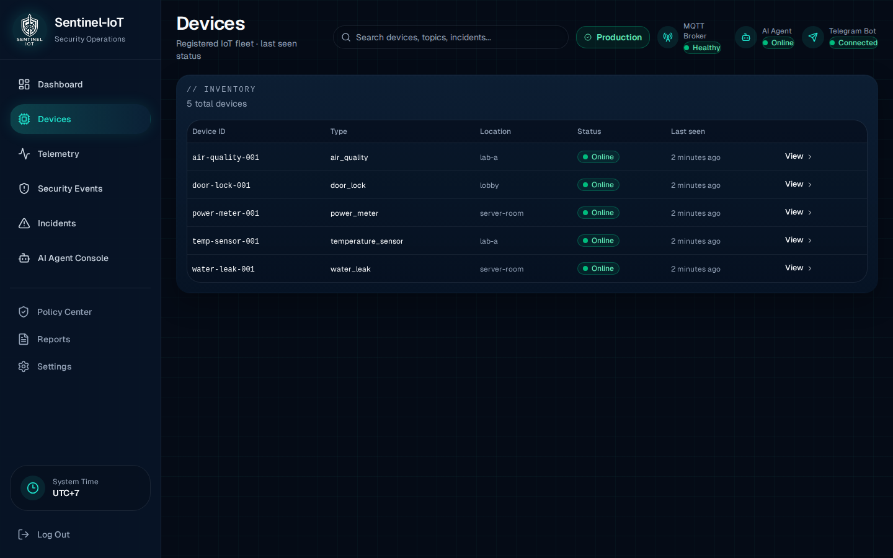
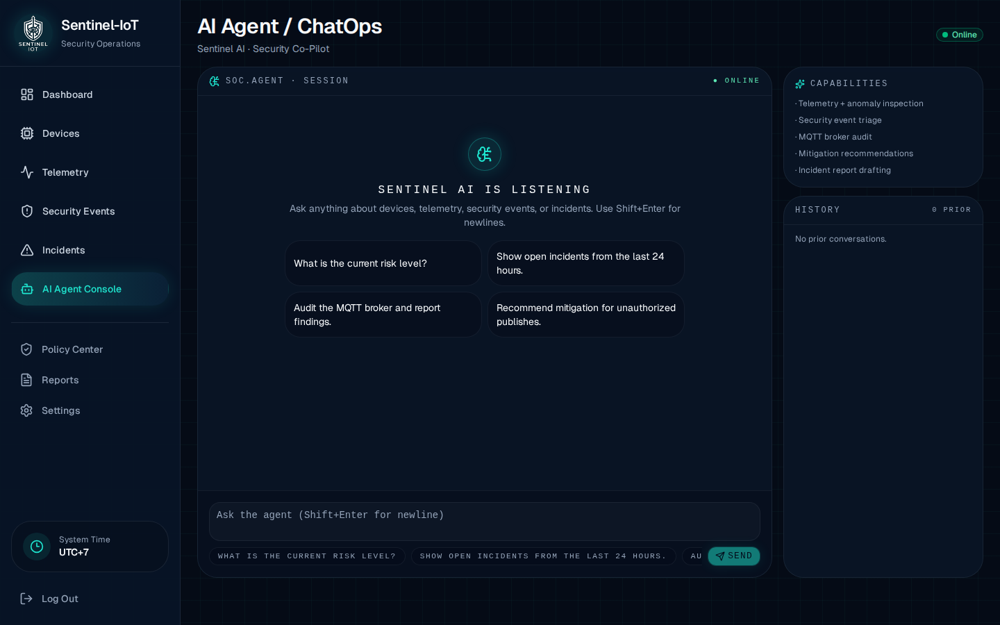
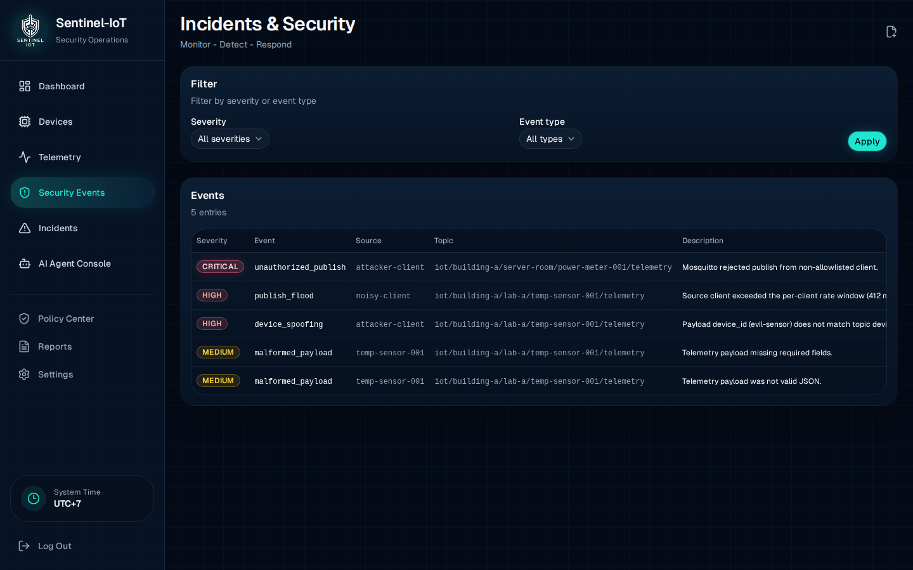
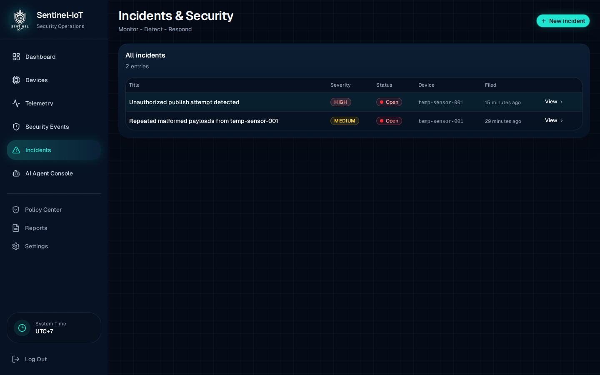
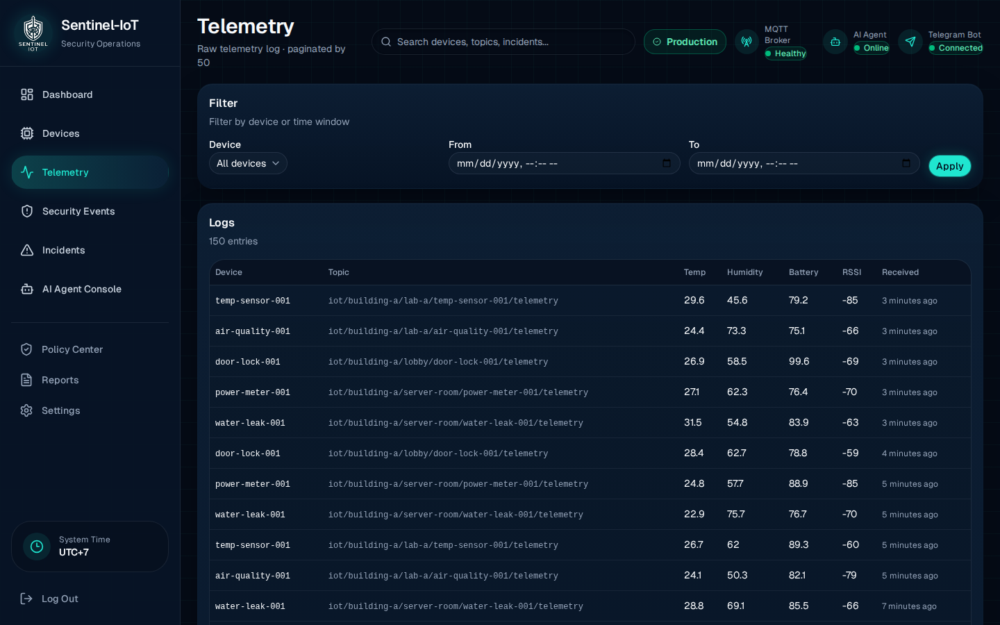
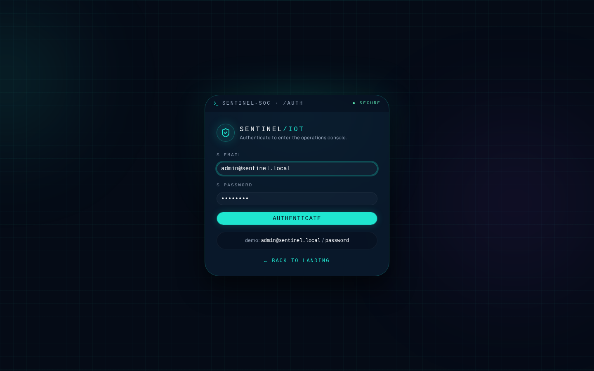
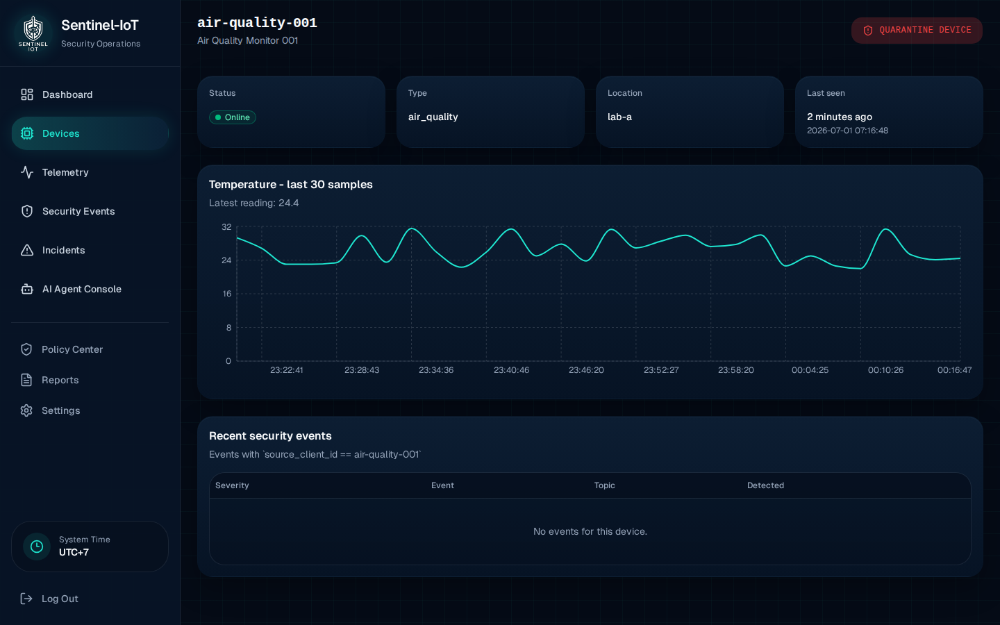

<p align="center">
  
</p>

<h1 align="center">Sentinel-IoT</h1>

<p align="center">
  <strong>AI Agent-Based Security Operations Center for IoT Infrastructure</strong>
</p>

<p align="center">
  Real-time MQTT threat detection, automated incident analysis, and ChatOps — powered by Laravel, React, and AI Agents.
</p>

<p align="center">
  
  
  
  
  
  
  
</p>

---

## Tentang Project

Sentinel-IoT adalah platform **Security Operations Center (SOC)** yang dirancang khusus untuk infrastruktur IoT berbasis MQTT. Sistem ini memantau perangkat IoT secara real-time, mendeteksi ancaman keamanan (payload tidak valid, publikasi tidak sah, spoofing perangkat), dan menggunakan **AI Agent** untuk menghasilkan laporan insiden serta rekomendasi keamanan secara otomatis.

> **Konteks akademik:** Project ini dikembangkan sebagai bagian dari tugas akhir / skripsi dengan topik _"AI Agent-Based IoT Security Operation Center with Telegram ChatOps"_. Arsitektur dan fitur dirancang sesuai PRD (Product Requirements Document) yang telah ditetapkan.

### Apa yang bisa dilakukan?

- **Monitoring real-time** — dashboard menampilkan status perangkat, telemetry MQTT, dan skor keamanan secara live.
- **Deteksi ancaman** — Python ingestor memvalidasi setiap payload MQTT dan mendeteksi anomali (malformed, unauthorized, spoofed).
- **AI Incident Analyst** — agent AI (OpenAI / Anthropic / Gemini) menghasilkan laporan insiden, analisis root cause, dan rekomendasi mitigasi.
- **Telegram ChatOps** — bot Telegram menyediakan akses read-only ke status sistem, daftar insiden, dan laporan dari mana saja.
- **Multi-tenancy** — setiap tenant memiliki isolasi data (perangkat, telemetry, insiden) dan namespace MQTT sendiri.

### Screenshot

| Landing Page | Dashboard |
|:---:|:---:|
|  |  |

| Devices | AI Agent |
|:---:|:---:|
|  |  |

<details>
<summary>Lihat semua screenshot</summary>

| Security Events | Incidents | Telemetry |
|:---:|:---:|:---:|
|  |  |  |

| Login | Device Detail |
|:---:|:---:|
|  |  |

</details>

---

## Arsitektur

```
┌─────────────┐    MQTT     ┌──────────────┐    SQL     ┌────────────┐
│  Simulator   │───────────▶│   Mosquitto   │──────────▶│  PostgreSQL │
│  (Python)    │            │   Broker      │           │  Database   │
└─────────────┘            └──────┬───────┘           └─────┬──────┘
                                  │                          │
                                  ▼                          ▼
                          ┌──────────────┐           ┌────────────┐
                          │    Python     │           │   Laravel   │
                          │   Ingestor    │──────────▶│   (Web +    │
                          │  (Validator)  │           │  API + AI)  │
                          └──────────────┘           └──────┬─────┘
                                                            │
                                              ┌─────────────┼─────────────┐
                                              ▼             ▼             ▼
                                        ┌──────────┐ ┌──────────┐ ┌──────────┐
                                        │  React   │ │  REST    │ │ Telegram │
                                        │Dashboard │ │  API     │ │   Bot    │
                                        └──────────┘ └──────────┘ └──────────┘
```

Alur data: **Simulator → Mosquitto (MQTT) → Python Ingestor (validasi & deteksi) → PostgreSQL → Laravel (web, API, AI Agent) → Dashboard / Telegram**

---

## Tech Stack

| Layer | Teknologi |
|---|---|
| **Frontend** | React 19, Inertia.js v3, Tailwind CSS v4, TypeScript |
| **Backend** | Laravel 13, PHP 8.5, Eloquent ORM |
| **AI Agent** | Laravel AI SDK (OpenAI, Anthropic, Gemini) |
| **Database** | PostgreSQL 16 |
| **Message Broker** | Eclipse Mosquitto (MQTT v3.1.1) |
| **Ingestor** | Python 3.12+, paho-mqtt |
| **ChatOps** | Telegram Bot API (python-telegram-bot) |
| **Testing** | Pest 4 (Laravel), pytest (Python) |
| **Infra** | Docker Compose, Caddy (reverse proxy) |

---

## Quick Start

### Prerequisites

- **Docker Desktop** (dengan Compose v2)
- **Git**
- API key untuk AI Agent (pilih salah satu): `OPENAI_API_KEY`, `ANTHROPIC_API_KEY`, atau `GEMINI_API_KEY`

### 1. Clone & Setup

```bash
git clone https://github.com/nabiilnuryassar/sentinel-iot.git
cd sentinel-iot
cp .env.example .env
```

Edit `.env` dan set API key untuk AI Agent:

```env
OPENAI_API_KEY=sk-...          # atau
ANTHROPIC_API_KEY=sk-ant-...   # atau
GEMINI_API_KEY=AIza...
```

### 2. Jalankan (Development)

```bash
docker compose -f docker-compose.yml -f docker-compose.dev.yml up -d
docker compose -f docker-compose.yml -f docker-compose.dev.yml exec laravel-app php artisan key:generate
docker compose -f docker-compose.yml -f docker-compose.dev.yml exec laravel-app php artisan migrate --no-interaction
docker compose -f docker-compose.yml -f docker-compose.dev.yml exec laravel-app php artisan db:seed --class=DemoSeeder --no-interaction
```

Buka **http://localhost:8000** dan login dengan:

| Field | Value |
|---|---|
| Email | `admin@sentinel.local` |
| Password | `password` |

> Vite HMR berjalan di port 5173 — edit file `.tsx` atau `.css` dan browser akan refresh otomatis.

### 3. Telegram Bot (Opsional)

```bash
# Generate API token untuk bot
docker compose -f docker-compose.yml -f docker-compose.dev.yml exec laravel-app php artisan sentinel:issue-tokens

# Copy BOT_API_TOKEN ke .env sebagai LARAVEL_API_TOKEN, lalu:
docker compose -f docker-compose.yml -f docker-compose.dev.yml --profile bot up -d telegram-bot
```

### 4. Verifikasi

```bash
docker compose -f docker-compose.yml -f docker-compose.dev.yml exec laravel-app php artisan sentinel:health
```

Pastikan semua centang hijau. Jika AI provider berwarna kuning, berarti API key belum diset (agent akan menggunakan fallback).

---

## Demo Scenarios

Sistem ini dirancang dengan 4 skenario demo sesuai PRD:

| # | Senario | Cara Menjalankan |
|---|---|---|
| 1 | **Normal telemetry** | Jalankan simulator, amati dashboard terisi data real-time |
| 2 | **Malformed payload** | `services/attack-simulator/malformed_payload.py` |
| 3 | **Unauthorized + Spoofed publish** | `unauthorized_publish.py` lalu `spoof_device.py` |
| 4 | **Incident report** | Klik "Create incident" pada event spoof, lalu "Generate report" |

Detail lengkap: [`docs/DEMO_SCENARIO.md`](docs/DEMO_SCENARIO.md)

---

## Struktur Project

```
sentinel-iot/
├── app/
│   ├── Ai/                    # AI Agent definitions & middleware
│   │   ├── Agents/            # SentinelAgent, IncidentAnalyst, AuditAgent
│   │   ├── Gateway/           # AI provider gateway abstraction
│   │   └── Middleware/        # Agent interaction logging
│   ├── Http/Controllers/      # Laravel controllers
│   ├── Models/                # Eloquent models (multi-tenant scoped)
│   └── ...
├── resources/
│   ├── ai/prompts/            # System prompts untuk AI agents
│   ├── js/pages/              # React pages (Inertia.js)
│   │   ├── welcome.tsx        # Landing page
│   │   ├── dashboard.tsx      # Main dashboard
│   │   ├── agent/             # AI Agent chat interface
│   │   ├── devices/           # Device management
│   │   └── ...
│   └── css/                   # Tailwind + custom styles
├── services/
│   ├── attack-simulator/      # Python attack scripts (demo scenarios)
│   ├── mqtt-ingestor/         # Python MQTT validator & threat detector
│   └── telegram-bot/          # Telegram ChatOps bot
├── docker/                    # Dockerfiles & Caddy config
├── docs/                      # Dokumentasi project
├── docker-compose.yml         # Base compose
├── docker-compose.dev.yml     # Development overrides
└── docker-compose.prod.yml    # Production config
```

---

## Testing

```bash
# Laravel (Pest 4)
docker compose -f docker-compose.yml -f docker-compose.dev.yml exec -T laravel-app php artisan test --compact

# Python ingestor
docker compose -f docker-compose.yml -f docker-compose.dev.yml exec -T mqtt-ingestor pytest /app/tests/

# Telegram bot
cd services/telegram-bot && python -m pytest
```

---

## Dokumentasi

| Dokumen | Deskripsi |
|---|---|
| [`docs/PRD.md`](docs/PRD.md) | Product Requirements Document (canonical) |
| [`docs/ARCHITECTURE.md`](docs/ARCHITECTURE.md) | Arsitektur sistem & diagram |
| [`docs/API.md`](docs/API.md) | REST API surface |
| [`docs/DATABASE.md`](docs/DATABASE.md) | Referensi skema database |
| [`docs/DEMO_SCENARIO.md`](docs/DEMO_SCENARIO.md) | Runbook 4 skenario demo |
| [`docs/UI_GUIDE.md`](docs/UI_GUIDE.md) | Design system & component map |
| [`docs/MULTI_TENANCY.md`](docs/MULTI_TENANCY.md) | Model multi-tenancy & MQTT namespacing |

---

## Stop Semua Service

```bash
docker compose -f docker-compose.yml -f docker-compose.dev.yml down
```

Tambahkan `-v` untuk menghapus volume database (berguna untuk re-seed dari awal).

---

## License

MIT License. Lihat [`LICENSE`](LICENSE) untuk detail.

---

<p align="center">
  Dikembangkan sebagai proyek tugas akhir / skripsi<br>
  <strong>Universitas — Teknik Informatika</strong>
</p>
