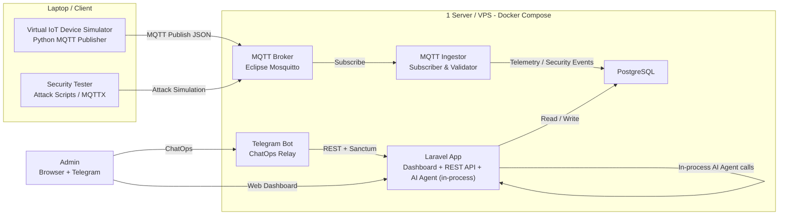
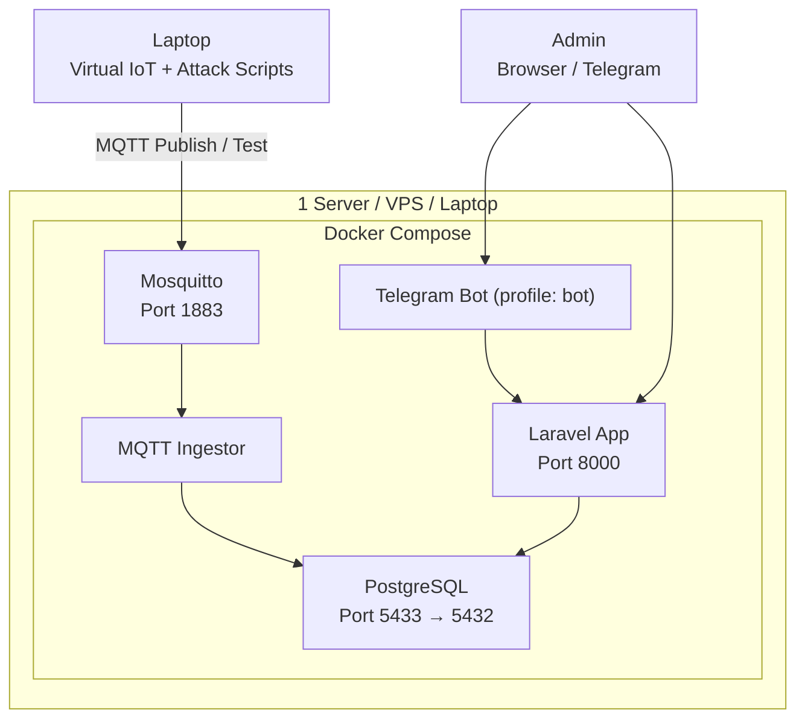
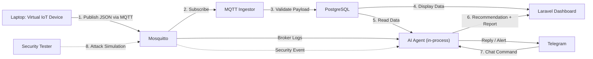

# Architecture

This document is extracted and condensed from PRD §8, §9, and §29 plus
implementation notes from `thoughts/shared/designs/sentinel-iot-design.md`.
The PRD is the canonical source for "what we want"; this file is the working
reference for "how it actually fits together today".

## High-level architecture (PRD §8.1)



The MVP collapses the PRD's separate "AI Agent Service" and "Database" boxes
into the Laravel container — the agent runs in-process via the Laravel AI
SDK (Design D3). InfluxDB stays excluded (Design D1).

## Single-server deployment (PRD §9)



Containers (see `docker-compose.yml`):

| Service        | Image / Source                          | Ports     | Notes                                                |
|----------------|------------------------------------------|-----------|------------------------------------------------------|
| `mosquitto`    | `eclipse-mosquitto:2`                   | 1883      | `allow_anonymous false`, ACL + passwordfile mounted  |
| `postgres`     | `postgres:16`                            | 5433→5432 | Host port remapped to avoid host Postgres conflicts  |
| `laravel-app`  | `docker/laravel.Dockerfile`             | 8000      | `php artisan serve` (dev-grade)                       |
| `mqtt-ingestor`| `services/mqtt-ingestor/Dockerfile`     | —         | paho-mqtt v2 + psycopg                                |
| `telegram-bot` | `services/telegram-bot/Dockerfile`      | —         | Profile `bot`; only starts with `--profile bot`       |

## End-to-end workflow (PRD §29)



## Where things live

| Concern                            | Path                                            |
|------------------------------------|-------------------------------------------------|
| Virtual device simulator           | `simulator/`                                    |
| MQTT ingestor (Python)             | `services/mqtt-ingestor/`                       |
| Telegram bot (Python)              | `services/telegram-bot/`                        |
| Attack scripts                     | `services/attack-simulator/`                    |
| Laravel controllers (web)          | `app/Http/Controllers/`                         |
| Laravel controllers (api)          | `app/Http/Controllers/Api/`                     |
| Eloquent models                    | `app/Models/`                                   |
| AI agents                          | `app/Ai/Agents/`                                |
| AI tools (read-only)               | `app/Ai/Tools/`                                 |
| Agent prompts                      | `resources/ai/prompts/`                         |
| Inertia React pages                | `resources/js/pages/`                           |
| shadcn primitives                  | `resources/js/components/ui/`                   |
| Domain UI shells                   | `resources/js/components/`                      |
| Wayfinder route helpers            | `resources/js/{actions,routes}/`                |
| Migrations                         | `database/migrations/`                          |
| Seeders (default + demo)           | `database/seeders/`                             |
| Pest feature/unit tests            | `tests/Feature/`, `tests/Unit/`                 |
| Mosquitto config                   | `mosquitto/config/`                             |
| Compose definition                 | `docker-compose.yml`, `docker-compose.override.yml.example` |

## Realtime layer

The agent console streams tokens to the browser without Reverb / Echo.

```
User browser
  │  POST /agent/stream  (CSRF, fetch + ReadableStream)
  ▼
AgentController::stream
  │  SentinelAgent::stream($prompt)
  ▼
Laravel\Ai\Responses\StreamableAgentResponse  —→  TextDelta / ToolCall / TextEnd
  │  iterates events
  ▼
response()->stream(...)  →  text/event-stream  →  browser tokens
  │
  │  on stream end:
  │    1. LogAgentInteractions middleware writes `agent_messages` row
  │    2. AgentMessageCompleted event is dispatched
  │    3. AGENT_WEBHOOK_URL (if set) gets a fire-and-forget POST
  ▼
In-process listeners + external webhooks
```

SSE event payloads (one per `data:` line):

| `type`     | Fields                                                           |
|------------|------------------------------------------------------------------|
| `start`    | —                                                                |
| `delta`    | `content` (token text)                                           |
| `tool`     | `name`, `phase` = `call` \| `result`                             |
| `turn_end` | — (text generation complete; audit row about to be written)     |
| `end`      | `text`, `conversation_id`, `duration_ms`                         |
| `error`    | `message`                                                        |

The terminator is the literal line `data: [DONE]`.

Reverb is intentionally not enabled. If broadcast is needed later, set
`BROADCAST_DRIVER=reverb` and add `ShouldBroadcast` to
`App\Events\AgentMessageCompleted` — the existing payload contract is
already broadcast-shaped.

## Boundaries (data contracts)

- **MQTT telemetry payload** (PRD §12.1): `device_id`, `type`, `timestamp`,
  `location` are required; the rest is type-specific and lands in
  `telemetry_logs.payload_json`.
- **MQTT topic** (PRD §12.1): `iot/{building}/{room}/{device_id}/telemetry`.
  The ingestor cross-checks the topic's `device_id` against the payload's;
  mismatch ⇒ `device_spoofing` security event.
- **REST API**: `auth:sanctum` for `/api/*`, `auth` (session) for web. See
  `docs/API.md`.
- **AI agent**: in-process tool calls only. Tools never write — they read
  the DB and return JSON. Persistence happens in the controller after the
  agent returns.

## Decisions log

See `thoughts/shared/progress/sentinel-iot-progress.md` §6 for the full
decision index. Highlights:

- **D1**: PostgreSQL only, no InfluxDB.
- **D2**: Python ingestor sidecar instead of a Laravel queue worker.
- **D3**: Laravel AI SDK runs in-process — no separate FastAPI service.
- **D5**: Inertia React + shadcn/ui (not Filament).
- **D6**: Telemetry append-only with `(device_id, received_at desc)` index.
- **D7**: Security event creation centralised in the ingestor.
- **D8**: Incident lifecycle `open → investigating → mitigated → closed`;
  severity is a string enum.
- **D9**: Single-admin auth model; Sanctum tokens for Python services.
