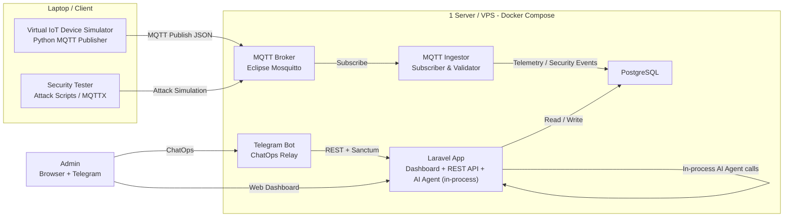
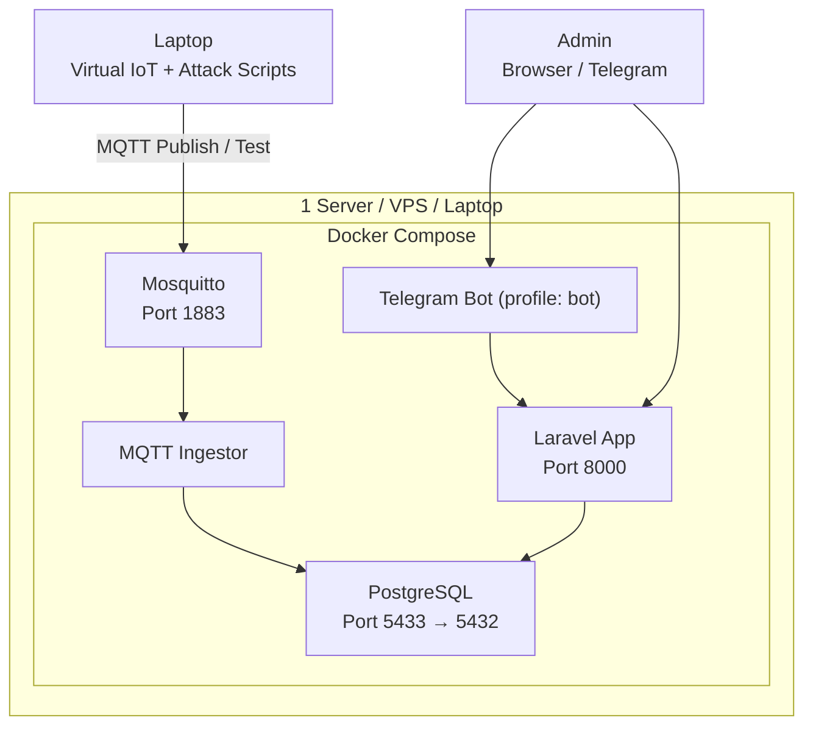
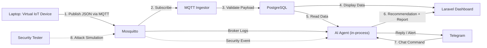

# Architecture

This document is extracted and condensed from PRD §8, §9, and §29 plus
implementation notes from `thoughts/shared/designs/sentinel-iot-design.md`.
The PRD is the canonical source for "what we want"; this file is the working
reference for "how it actually fits together today".

## High-level architecture (PRD §8.1)



The MVP collapses the PRD's separate "AI Agent Service" and "Database" boxes
into the Laravel container — the agent runs in-process via the Laravel AI
SDK (Design D3). InfluxDB stays excluded (Design D1).

## Single-server deployment (PRD §9)



Containers (see `docker-compose.yml`):

| Service        | Image / Source                          | Ports     | Notes                                                |
|----------------|------------------------------------------|-----------|------------------------------------------------------|
| `mosquitto`    | `eclipse-mosquitto:2`                   | 1883      | `allow_anonymous false`, ACL + passwordfile mounted  |
| `postgres`     | `postgres:16`                            | 5433→5432 | Host port remapped to avoid host Postgres conflicts  |
| `laravel-app`  | `docker/laravel.Dockerfile`             | 8000      | `php artisan serve` (dev-grade)                       |
| `mqtt-ingestor`| `services/mqtt-ingestor/Dockerfile`     | —         | paho-mqtt v2 + psycopg                                |
| `telegram-bot` | `services/telegram-bot/Dockerfile`      | —         | Profile `bot`; only starts with `--profile bot`       |

## End-to-end workflow (PRD §29)



## Where things live

| Concern                            | Path                                            |
|------------------------------------|-------------------------------------------------|
| Virtual device simulator           | `simulator/`                                    |
| MQTT ingestor (Python)             | `services/mqtt-ingestor/`                       |
| Telegram bot (Python)              | `services/telegram-bot/`                        |
| Attack scripts                     | `services/attack-simulator/`                    |
| Laravel controllers (web)          | `app/Http/Controllers/`                         |
| Laravel controllers (api)          | `app/Http/Controllers/Api/`                     |
| Eloquent models                    | `app/Models/`                                   |
| AI agents                          | `app/Ai/Agents/`                                |
| AI tools (read-only)               | `app/Ai/Tools/`                                 |
| Agent prompts                      | `resources/ai/prompts/`                         |
| Inertia React pages                | `resources/js/pages/`                           |
| shadcn primitives                  | `resources/js/components/ui/`                   |
| Domain UI shells                   | `resources/js/components/`                      |
| Wayfinder route helpers            | `resources/js/{actions,routes}/`                |
| Migrations                         | `database/migrations/`                          |
| Seeders (default + demo)           | `database/seeders/`                             |
| Pest feature/unit tests            | `tests/Feature/`, `tests/Unit/`                 |
| Mosquitto config                   | `mosquitto/config/`                             |
| Compose definition                 | `docker-compose.yml`, `docker-compose.override.yml.example` |

## Realtime layer

The agent console streams tokens to the browser without Reverb / Echo.

```
User browser
  │  POST /agent/stream  (CSRF, fetch + ReadableStream)
  ▼
AgentController::stream
  │  SentinelAgent::stream($prompt)
  ▼
Laravel\Ai\Responses\StreamableAgentResponse  —→  TextDelta / ToolCall / TextEnd
  │  iterates events
  ▼
response()->stream(...)  →  text/event-stream  →  browser tokens
  │
  │  on stream end:
  │    1. LogAgentInteractions middleware writes `agent_messages` row
  │    2. AgentMessageCompleted event is dispatched
  │    3. AGENT_WEBHOOK_URL (if set) gets a fire-and-forget POST
  ▼
In-process listeners + external webhooks
```

SSE event payloads (one per `data:` line):

| `type`     | Fields                                                           |
|------------|------------------------------------------------------------------|
| `start`    | —                                                                |
| `delta`    | `content` (token text)                                           |
| `tool`     | `name`, `phase` = `call` \| `result`                             |
| `turn_end` | — (text generation complete; audit row about to be written)     |
| `end`      | `text`, `conversation_id`, `duration_ms`                         |
| `error`    | `message`                                                        |

The terminator is the literal line `data: [DONE]`.

Reverb is intentionally not enabled. If broadcast is needed later, set
`BROADCAST_DRIVER=reverb` and add `ShouldBroadcast` to
`App\Events\AgentMessageCompleted` — the existing payload contract is
already broadcast-shaped.

## Boundaries (data contracts)

- **MQTT telemetry payload** (PRD §12.1): `device_id`, `type`, `timestamp`,
  `location` are required; the rest is type-specific and lands in
  `telemetry_logs.payload_json`.
- **MQTT topic** (PRD §12.1): `iot/{building}/{room}/{device_id}/telemetry`.
  The ingestor cross-checks the topic's `device_id` against the payload's;
  mismatch ⇒ `device_spoofing` security event.
- **REST API**: `auth:sanctum` for `/api/*`, `auth` (session) for web. See
  `docs/API.md`.
- **AI agent**: in-process tool calls only. Tools never write — they read
  the DB and return JSON. Persistence happens in the controller after the
  agent returns.

### AI Agent: Honest Capabilities

The AI agent in Sentinel-IoT is an **LLM orchestrator**, not a custom-trained ML model. Understanding this distinction is critical for setting realistic expectations:

**What the agent does:**
- Calls 9 PHP tool classes to fetch structured data from PostgreSQL
- Passes tool results to an external LLM (OpenAI/Anthropic/Gemini) via `laravel/ai` SDK
- Returns LLM-generated natural language responses with citations to tool data

**What the agent does NOT do:**
- Train on your specific IoT data patterns
- Detect zero-day threats or novel attack vectors
- Learn from past incidents to improve future recommendations
- Make autonomous decisions (all actions require admin approval)
- Run inference locally (requires internet connection to LLM provider)

**Anomaly detection is statistical, not ML:**
The `AnalyzeAnomaly` tool uses simple z-score calculation (μ ± 3σ) on numeric telemetry fields. It will flag obvious outliers but cannot detect:
- Gradual drift or degradation
- Multi-device correlation patterns
- Protocol-level attacks that produce "normal-looking" telemetry
- Context-dependent anomalies (e.g., temperature spike during maintenance window)

**For production deployment, consider:**
- Adding custom ML models as additional tools (e.g., `DetectAnomalyWithML`)
- Integrating threat intelligence feeds (CVE databases, MITRE ATT&CK)
- Implementing automated response workflows with approval gates
- Setting up model monitoring and drift detection
- Budgeting for LLM API costs (estimate $0.01-0.05 per agent interaction)

## Multi-tenant isolation (SaaS ready)

Sentinel-IoT supports multi-tenant deployments where a single instance serves
multiple organizations (tenants) with strict data isolation.

```mermaid
flowchart TB
    subgraph TENANT_A["Tenant: ACME Corp"]
        U_A["Users (tenant_id=1)"]
        D_A["Devices (tenant_id=1)"]
        T_A["Telemetry (tenant_id=1)"]
        S_A["Security Events (tenant_id=1)"]
        I_A["Incidents (tenant_id=1)"]
    end

    subgraph TENANT_B["Tenant: Globex Inc"]
        U_B["Users (tenant_id=2)"]
        D_B["Devices (tenant_id=2)"]
        T_B["Telemetry (tenant_id=2)"]
        S_B["Security Events (tenant_id=2)"]
        I_B["Incidents (tenant_id=2)"]
    end

    subgraph DB["PostgreSQL"]
        USERS["users table"]
        DEVICES["devices table"]
        TELEMETRY["telemetry_logs table"]
        EVENTS["security_events table"]
        INCIDENTS["incidents table"]
    end

    U_A --> USERS
    U_B --> USERS
    D_A --> DEVICES
    D_B --> DEVICES
    T_A --> TELEMETRY
    T_B --> TELEMETRY
    S_A --> EVENTS
    S_B --> EVENTS
    I_A --> INCIDENTS
    I_B --> INCIDENTS

    BELONGS["BelongsToTenant Trait<br/>(Global Scope)"] -.-> USERS
    BELONGS -.-> DEVICES
    BELONGS -.-> TELEMETRY
    BELONGS -.-> EVENTS
    BELONGS -.-> INCIDENTS
```



### Data isolation mechanism

All tenant-aware models use the `BelongsToTenant` trait which:

1. **Global scope**: Automatically filters all queries to `WHERE tenant_id = current_user.tenant_id`
2. **Auto-assignment**: Sets `tenant_id` on model creation via `creating` event
3. **Relationships**: Ensures related models inherit tenant context

Affected models:
 `User`, `Device`, `TelemetryLog`, `SecurityEvent`
 `Incident`, `IncidentReport`, `DevicePolicy`, `AgentMessage`

### AI tools tenant scoping

The AI Agent's tools automatically respect tenant boundaries:

 `GetDeviceStatus` → only sees devices in current tenant
 `GetRecentTelemetry` → only reads telemetry for tenant's devices
 `GetOpenIncidents` → only lists tenant's incidents
 `GetSecurityEvents` → only sees tenant's security events
 `AnalyzeAnomaly` → analyzes only tenant's telemetry
 `GenerateIncidentReport` → generates reports only for tenant's incidents

No cross-tenant data leakage is possible through the AI interface.

### MQTT namespace isolation

Each tenant publishes to a unique MQTT topic namespace:

```
tenants/{tenant_slug}/iot/{building}/{room}/{device_id}/telemetry
```

Mosquitto ACLs enforce this at the broker level (see `docs/MULTI_TENANT_MQTT.md`).

### Tenant provisioning

```bash
# Create a new tenant with unique MQTT namespace
php artisan tenant:provision acme-corp

# Output:
# Tenant: acme-corp (ID: 1)
# MQTT Username: acme-corp
# MQTT Password: [generated]
# Topic Prefix: tenants/acme-corp/iot/
```

The Python ingestor extracts `tenant_slug` from MQTT topics and assigns
`tenant_id` to telemetry/security events automatically.

### Migration strategy

Existing single-tenant deployments can migrate to multi-tenant:

```php
// database/migrations/2024_01_15_000000_create_multi_tenant_schema.php
Schema::table('devices', function (Blueprint $table) {
    $table->foreignId('tenant_id')->nullable()->constrained()->cascadeOnDelete();
});

// Migrate existing data to "default" tenant
$defaultTenant = Tenant::create(['name' => 'Default', 'slug' => 'default']);
Device::query()->update(['tenant_id' => $defaultTenant->id]);
```

See `docs/MULTI_TENANT_MQTT.md` for MQTT credential management.
## Decisions log

See `thoughts/shared/progress/sentinel-iot-progress.md` §6 for the full
decision index. Highlights:

- **D1**: PostgreSQL only, no InfluxDB.
- **D2**: Python ingestor sidecar instead of a Laravel queue worker.
- **D3**: Laravel AI SDK runs in-process — no separate FastAPI service.
- **D5**: Inertia React + shadcn/ui (not Filament).
- **D6**: Telemetry append-only with `(device_id, received_at desc)` index.
- **D7**: Security event creation centralised in the ingestor.
- **D8**: Incident lifecycle `open → investigating → mitigated → closed`;
  severity is a string enum.
- **D9**: Single-admin auth model; Sanctum tokens for Python services.
