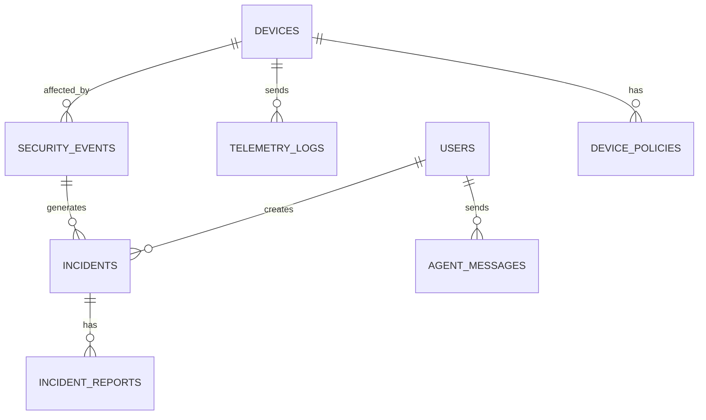

# Database

PostgreSQL 16 in Docker; host port `5433` → container `5432` (host conflict
with a system Postgres on `5432`). The schema below is extracted from PRD
§13 with the columns that actually shipped in the migrations.

## ERD (PRD §13.1)



`SECURITY_EVENTS.source_client_id` and `INCIDENTS.affected_device_id` are
**string** soft FKs into `devices.device_id` (Design D7 / D8). They aren't
enforced at the DB level so spoof / unknown-client events still land.

## Tables

### `users`

```text
id                bigint pk
name              string
email             string unique
password          string
email_verified_at timestamp nullable
created_at        timestamp
updated_at        timestamp
```

### `devices`

```text
id              bigint pk
device_id       string unique  -- natural key used for joins
name            string
type            string         -- temperature_sensor | door_lock | power_meter | air_quality | water_leak
location        string nullable
status          string         -- online | offline | unknown
last_seen_at    timestamp nullable
metadata_json   jsonb nullable
created_at      timestamp
updated_at      timestamp
```

### `telemetry_logs`

```text
id            bigint pk
device_id     string  -- soft FK → devices.device_id
topic         string
payload_json  jsonb
temperature   float nullable
humidity      float nullable
battery       float nullable
rssi          integer nullable
received_at   timestamp
created_at    timestamp
```

Index: `(device_id, received_at desc)` (Design D6).

### `security_events`

```text
id                bigint pk
event_type        string   -- malformed_payload | device_spoofing | unauthorized_publish | publish_flood
severity          string   -- low | medium | high | critical
source_client_id  string nullable  -- soft FK; may not exist in devices
topic             string nullable
payload_json      jsonb nullable
description       text nullable
detected_at       timestamp
created_at        timestamp
```

Index: `(severity, detected_at desc)` (Design D6).

### `incidents`

```text
id                  bigint pk
title               string
severity            string  -- low | medium | high | critical
status              string  -- open | investigating | mitigated | closed
affected_device_id  string nullable  -- soft FK → devices.device_id
summary             text nullable
root_cause          text nullable
recommendation      text nullable
created_by          bigint nullable  -- → users.id
created_at          timestamp
updated_at          timestamp
```

### `incident_reports`

```text
id              bigint pk
incident_id     bigint   -- → incidents.id
report_markdown text
generated_by    string nullable  -- user id or 'agent'
generated_at    timestamp
created_at      timestamp
```

### `agent_messages`

```text
id            bigint pk
user_id       bigint nullable  -- → users.id
source        string           -- web | telegram | system
prompt        text
response      text nullable
metadata_json jsonb nullable
created_at    timestamp
```

### `device_policies`

```text
id                 bigint pk
device_id          string   -- → devices.device_id
allowed_client_id  string nullable
allowed_topic      string nullable
can_publish        boolean default true
can_subscribe      boolean default true
is_active          boolean default true
created_at         timestamp
updated_at         timestamp
```

## SDK-shipped tables

These come with installed packages; they live in our DB but we don't own
the schema directly.

### `personal_access_tokens` (Laravel Sanctum)

Standard Sanctum table. Used for the bot token. Each call to
`$user->createToken('bot')` inserts a row; `$user->tokens()->where('name',
'bot')->delete()` revokes them.

### `agent_conversations` (Laravel AI SDK)

Tracks the agent's stateful conversations. Table name is configurable via
`config/ai.php` `conversations.tables.conversations`. Default
`agent_conversations`.

### `agent_conversation_messages` (Laravel AI SDK)

Per-turn message log keyed by conversation. Default
`agent_conversation_messages`. Used by agents that pull in the
`Conversational` / `RemembersConversations` traits — `IncidentAnalyst`
deliberately does **not**, so each report-generation call is one-shot.

## Migration order

```text
0001_01_01_000000  users
0001_01_01_000001  cache
0001_01_01_000002  jobs
2026_05_15_173911  devices
2026_05_15_173912  security_events
2026_05_15_173912  telemetry_logs
2026_05_15_212447  incidents
2026_05_15_212448  incident_reports
2026_05_15_212449  agent_messages
2026_05_15_212450  device_policies
2026_05_16_071648  personal_access_tokens
2026_05_16_074336  agent_conversations / agent_conversation_messages
```

## Seeding

- `php artisan db:seed` runs `DatabaseSeeder` — admin user, 5 devices, baseline
  telemetry, a couple of security events, one open incident.
- `php artisan db:seed --class=DemoSeeder --no-interaction` runs the demo
  dataset for the Phase 7 walkthrough: idempotent truncate + reseed of
  runtime tables, fresh telemetry and events, two open incidents, and a
  rotated bot token printed as `BOT_API_TOKEN=<value>`.
