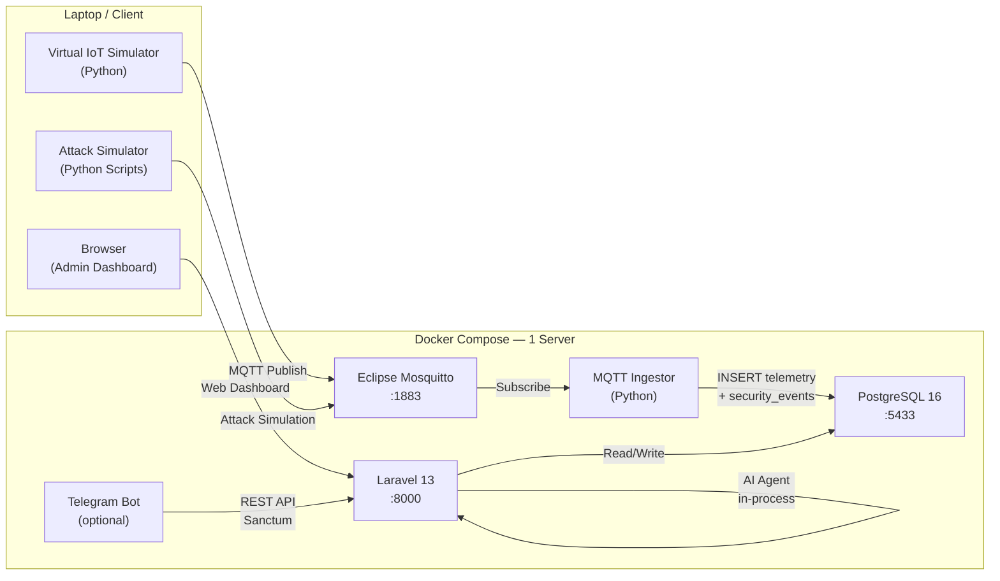

# 🎯 Sentinel-IoT — Demo MVP Walkthrough

> **Tanggal presentasi:** 1 Juli 2026, 09:00 WIB
> **Estimasi durasi demo:** 25–35 menit
> **Environment:** Docker Compose (dev mode)

---

## Arsitektur Sistem (Talking Point)



**Komponen utama:**
- **5 container Docker:** Mosquitto, PostgreSQL, Laravel App, MQTT Ingestor, Telegram Bot (opsional)
- **3 AI Agent:** SentinelAgent (ChatOps), IncidentAnalyst (report generation), AuditAgent (MQTT audit)
- **8 AI Tools:** GetDeviceStatus, GetRecentTelemetry, GetSecurityEvents, GetOpenIncidents, AnalyzeAnomaly, AuditMqttBroker, RecommendMitigation, GenerateIncidentReport
- **4 Attack Scripts:** malformed_payload, spoof_device, publish_flood, unauthorized_publish

---

## 📋 Pre-Demo Checklist

> [!IMPORTANT]
> Lakukan semua langkah ini **SEBELUM** presentasi dimulai (minimal 15 menit sebelumnya).

### 1. Pastikan Docker berjalan

```bash
docker compose -f docker-compose.yml -f docker-compose.dev.yml ps
```

**Expected output:** Semua container `running` / `healthy`:
| Container | Status yang diharapkan |
|---|---|
| `sentinel-mosquitto` | running (healthy) |
| `sentinel-postgres` | running (healthy) |
| `sentinel-mqtt-ingestor` | running |
| `sentinel-laravel` | running |

Jika belum berjalan:
```bash
docker compose -f docker-compose.yml -f docker-compose.dev.yml up -d
```

### 2. Seed demo data

```bash
docker exec sentinel-laravel php artisan db:seed --class=DemoSeeder --no-interaction
```

**Expected output:**
- `BOT_API_TOKEN=<token>` (di akhir output)
- Database terisi: 5 devices, 150 telemetry rows, 5 security events, 2 open incidents

### 3. Verifikasi health check

```bash
docker exec sentinel-laravel php artisan sentinel:health
```

**Expected:** Database ✅ dan MQTT broker ✅ hijau.

### 4. Buka browser dan pastikan halaman bisa diakses

- Buka `http://localhost:8000` → Landing page Sentinel-IoT
- Buka `http://localhost:8000/login` → Form login muncul

### 5. Siapkan terminal tambahan

Buka **3 terminal** terpisah:
1. **Terminal 1:** Untuk menjalankan simulator virtual device
2. **Terminal 2:** Untuk menjalankan attack scripts
3. **Terminal 3:** Untuk cek logs & database queries

### 6. Kredensial login

| Field | Value |
|---|---|
| Email | `admin@sentinel.local` |
| Password | `password` |

---

## 🎬 Demo Scenario 1 — Startup & Login (3 menit)

### Talking Point
> "Sentinel-IoT adalah platform keamanan IoT yang menerima data sensor melalui MQTT, mendeteksi ancaman secara real-time, dan menggunakan AI untuk analisis insiden."

### Langkah-langkah

1. **Buka landing page** → `http://localhost:8000`
   - ✅ Verifikasi: Tampilan landing page Sentinel-IoT dengan branding
   - 💬 *"Ini adalah halaman utama Sentinel-IoT. Mari kita masuk ke dashboard."*

2. **Login ke dashboard**
   - Klik **Login** atau navigasi ke `/login`
   - Masukkan kredensial:
     - Email: `admin@sentinel.local`
     - Password: `password`
   - Klik **Log in**
   - ✅ Verifikasi: Redirect ke `/dashboard`

---

## 🎬 Demo Scenario 2 — Dashboard Overview (5 menit)

### Talking Point
> "Dashboard memberikan gambaran real-time kondisi seluruh perangkat IoT, termasuk status keamanan dan insiden terbuka."

### Langkah-langkah

1. **Tunjukkan KPI Row (baris atas)**
   - ✅ Verifikasi tampil:
     - **Total Devices:** 5
     - **Online Devices:** 5
     - **Open Incidents:** 2
     - **Security Events Today:** 5
     - **Risk Level:** badge warna (medium/high)

2. **Tunjukkan Telemetry Chart**
   - ✅ Verifikasi: Grafik telemetry menunjukkan data (garis non-flat) dari 1 jam terakhir
   - 💬 *"Grafik ini menampilkan data telemetri real-time yang diterima dari sensor-sensor IoT."*

3. **Tunjukkan Device Health Card**
   - ✅ Verifikasi: Donut/bar chart menunjukkan 5 healthy devices

4. **Tunjukkan Security Score & MQTT Broker status**
   - ✅ Verifikasi: Security score card dan MQTT broker health indicator

5. **Tunjukkan Threat Feed (daftar security events terbaru)**
   - ✅ Verifikasi: 5 event security muncul di feed
   - 💬 *"Feed ini menampilkan ancaman keamanan terbaru yang terdeteksi oleh MQTT Ingestor."*

6. **Tunjukkan Incident Panel**
   - ✅ Verifikasi: 2 open incidents muncul

---

## 🎬 Demo Scenario 3 — Device Management (3 menit)

### Talking Point
> "Setiap perangkat IoT terdaftar dan dimonitor secara individual. Kita bisa melihat detail, telemetri terbaru, dan metadata perangkat."

### Langkah-langkah

1. **Navigasi ke halaman Devices** → klik "Devices" di sidebar atau buka `/devices`
   - ✅ Verifikasi: Tabel 5 devices tampil dengan kolom:
     - Device ID, Name, Type, Location, Status, Last Seen

2. **Klik salah satu device** (contoh: `temp-sensor-001`)
   - ✅ Verifikasi halaman detail device menampilkan:
     - Info device (name, type, location, firmware version)
     - Data telemetri terbaru (temperature, humidity, battery, rssi)
     - Status online/offline
   - 💬 *"Di sini kita bisa melihat data telemetri terbaru dari setiap sensor. Data ini dikirim melalui MQTT dan disimpan di PostgreSQL."*

3. **Tunjukkan halaman Telemetry** → navigasi ke `/telemetry`
   - ✅ Verifikasi: Tabel log telemetri dengan pagination
   - 💬 *"Semua data telemetri disimpan sebagai append-only log untuk audit trail."*

---

## 🎬 Demo Scenario 4 — Real-Time Telemetry Simulation (5 menit)

### Talking Point
> "Sekarang kita akan menjalankan simulator perangkat IoT virtual untuk menunjukkan alur data end-to-end."

### Langkah-langkah

1. **Jalankan virtual device simulator** (Terminal 1):

   ```bash
   docker run --rm -d --name sim-bg \
     --network sentinel-iot_default \
     -v "$PWD/simulator:/app" -w /app \
     -e MQTT_HOST=mosquitto \
     -e MQTT_USERNAME=sentinel_device \
     -e MQTT_PASSWORD=sentinel_mqtt_password \
     python:3.12-slim \
     sh -c 'pip install --quiet -r requirements.txt && python virtual_devices.py --interval 3'
   ```

   > Alternatif jika Python lokal tersedia:
   > ```bash
   > cd simulator
   > MQTT_HOST=localhost MQTT_PORT=1883 python virtual_devices.py --interval 3
   > ```

2. **Kembali ke browser → Dashboard**
   - ✅ Verifikasi: Refresh halaman, counter telemetry bertambah
   - ✅ Verifikasi: Grafik telemetry bergerak (data baru masuk setiap 3 detik)
   - 💬 *"Simulator mengirimkan data dari 5 virtual device setiap 3 detik. Data mengalir: Device → MQTT Broker → Ingestor → PostgreSQL → Dashboard."*

3. **Buka halaman Devices** → klik device mana saja
   - ✅ Verifikasi: `Last Seen` timestamp terupdate ke waktu terkini
   - ✅ Verifikasi: Data telemetri terbaru sesuai dengan output simulator

4. **Verifikasi via database** (Terminal 3 — opsional):
   ```bash
   docker compose exec postgres psql -U sentinel -d sentinel_iot -c \
     "SELECT device_id, temperature, humidity, received_at FROM telemetry_logs ORDER BY received_at DESC LIMIT 5;"
   ```

---

## 🎬 Demo Scenario 5 — Security Attack Simulation (7 menit)

### Talking Point
> "Sekarang kita akan mensimulasikan 3 jenis serangan keamanan untuk menunjukkan kemampuan deteksi real-time sistem."

---

### 5a. Malformed Payload Attack

💬 *"Serangan pertama: mengirim payload JSON yang tidak valid ke broker MQTT."*

**Jalankan** (Terminal 2):
```bash
cd services/attack-simulator
MQTT_HOST=localhost MQTT_PORT=1883 python malformed_payload.py
```

> Atau via Docker:
> ```bash
> docker run --rm --network sentinel-iot_default \
>   -v "$PWD/services/attack-simulator:/app" -w /app \
>   -e MQTT_HOST=mosquitto -e MQTT_PORT=1883 \
>   python:3.12-slim sh -c 'pip install --quiet paho-mqtt && python malformed_payload.py'
> ```

**Tunggu ~5 detik**, lalu:

1. Buka `/security-events`
   - ✅ Verifikasi: Row baru dengan:
     - `event_type` = `malformed_payload`
     - `severity` = `medium`
   - 💬 *"Ingestor mendeteksi payload yang tidak valid dan mencatat sebagai security event dengan severity medium."*

---

### 5b. Device Spoofing Attack

💬 *"Serangan kedua: client yang valid mencoba mengirim data dengan device_id palsu."*

**Jalankan** (Terminal 2):
```bash
MQTT_HOST=localhost MQTT_PORT=1883 python spoof_device.py
```

**Tunggu ~5 detik**, lalu:

1. Refresh `/security-events`
   - ✅ Verifikasi: Row baru dengan:
     - `event_type` = `device_spoofing`
     - `severity` = `high`
   - 💬 *"Ingestor melakukan cross-check antara device_id di topic MQTT dengan device_id di payload. Jika tidak cocok, terdeteksi sebagai device spoofing — severity high."*

---

### 5c. Unauthorized Publish (Broker-Level Rejection)

💬 *"Serangan ketiga: client tanpa kredensial mencoba connect ke broker."*

**Jalankan** (Terminal 2):
```bash
MQTT_HOST=localhost MQTT_PORT=1883 python unauthorized_publish.py
```

**Verifikasi** (Terminal 3):
```bash
docker logs sentinel-mosquitto --tail 30 | grep -i "denied\|refused\|not authorised\|attacker"
```

- ✅ Verifikasi: Log Mosquitto menunjukkan koneksi ditolak
- ✅ Verifikasi: **TIDAK ADA** row baru di `security_events` (ditolak di level broker, bukan ingestor)
- 💬 *"Serangan ini ditolak di level broker — client bahkan tidak bisa connect. Ini menunjukkan defense-in-depth: broker sebagai garis pertahanan pertama."*

---

### 5d. (Opsional) Publish Flood Attack

💬 *"Opsional: serangan flood — mengirim ratusan pesan dalam waktu singkat."*

```bash
MQTT_HOST=localhost MQTT_PORT=1883 python publish_flood.py
```

- ✅ Verifikasi di `/security-events`: `event_type` = `publish_flood`, `severity` = `high`

---

### Verifikasi Kumulatif di Dashboard

1. Kembali ke `/dashboard`
   - ✅ Verifikasi: **Security Events Today** counter bertambah
   - ✅ Verifikasi: **Risk Level** mungkin naik ke `high`
   - ✅ Verifikasi: Threat Feed menampilkan event-event baru

---

## 🎬 Demo Scenario 6 — Incident Management & AI Report (7 menit)

### Talking Point
> "Dari security events, kita bisa membuat insiden dan menggunakan AI untuk menghasilkan laporan analisis otomatis."

### 6a. Buat Insiden Baru dari Security Event

1. Buka `/security-events`
2. Cari event **device_spoofing** (yang baru dibuat dari Scenario 5b)
3. Klik **"Create Incident"** pada event tersebut
4. Isi form (pre-filled):
   - Title: (auto/isi sesuai)
   - Severity: `high`
   - Affected Device: `temp-sensor-001`
5. Submit
   - ✅ Verifikasi: Redirect ke halaman detail incident baru
   - 💬 *"Insiden dibuat dari security event. Sekarang kita gunakan AI untuk menganalisis insiden ini."*

### 6b. Generate AI Report

1. Di halaman detail incident (`/incidents/{id}`)
2. Klik tombol **"Generate Report"**
3. Tunggu ~5–10 detik (spinner muncul selama proses)
   - ✅ Verifikasi setelah selesai:
     - **Severity badge** terupdate sesuai rekomendasi AI
     - **Summary** terisi otomatis oleh AI
     - **Root Cause** terisi otomatis
     - **Recommendation** terisi otomatis
     - **Markdown Report** ter-render di bawah
   - 💬 *"AI Agent IncidentAnalyst menggunakan tools GetSecurityEvents dan GetRecentTelemetry untuk menganalisis insiden, lalu menghasilkan laporan terstruktur."*

4. **Tunjukkan report yang di-render** — scroll ke bawah
   - ✅ Verifikasi: Report markdown menampilkan sections:
     - Executive Summary
     - Root Cause Analysis
     - Impact Assessment
     - Recommendations

### 6c. Update Status Insiden

1. Di halaman detail incident, ubah status:
   - `open` → `investigating` → `mitigated` → `closed`
2. Klik **Update**
   - ✅ Verifikasi: Status badge berubah

---

## 🎬 Demo Scenario 7 — AI Agent / ChatOps (5 menit)

### Talking Point
> "AI Agent bisa digunakan untuk bertanya langsung tentang kondisi sistem, melakukan audit, dan mendapatkan rekomendasi."

### Langkah-langkah

1. **Navigasi ke Agent page** → klik "Agent" di sidebar atau `/agent`
   - ✅ Verifikasi: Chat interface muncul dengan empty state
   - ✅ Verifikasi: Status "● online" di header
   - ✅ Verifikasi: Quick prompts tersedia

2. **Kirim prompt pertama** — klik quick prompt atau ketik:
   > `What is the current risk level?`
   
   - ✅ Verifikasi: Streaming response muncul (token by token)
   - ✅ Verifikasi: Tool indicators muncul saat agent menggunakan tools (misal: "tool · GetDeviceStatus")
   - ✅ Verifikasi: Response lengkap muncul dengan informasi risk level
   - 💬 *"AI Agent melakukan multi-step reasoning — memanggil tools untuk membaca database, lalu menyusun jawaban berdasarkan data aktual."*

3. **Kirim prompt kedua:**
   > `Show open incidents from the last 24 hours.`
   
   - ✅ Verifikasi: Agent menampilkan daftar insiden terbuka
   - ✅ Verifikasi: Data sesuai dengan yang terlihat di dashboard

4. **Kirim prompt ketiga (audit):**
   > `Audit the MQTT broker and report findings.`
   
   - ✅ Verifikasi: Agent menggunakan AuditMqttBroker tool
   - ✅ Verifikasi: Laporan audit muncul

5. **Kirim prompt keempat (rekomendasi):**
   > `Recommend mitigation for unauthorized publishes.`
   
   - ✅ Verifikasi: Agent memberikan rekomendasi mitigasi spesifik

6. **Tunjukkan fitur UX:**
   - Klik **Copy** pada response → ✅ toast "Copied"
   - Klik **Regenerate** → ✅ response baru di-stream
   - Scroll ke atas, lalu ✅ verifikasi tombol **"↓ Latest"** muncul
   - 💬 *"Interface chat ini streaming langsung dari AI, dengan auto-scroll pintar dan scroll-to-bottom button."*

---

## 🧹 Post-Demo Cleanup

```bash
# Stop virtual device simulator
docker rm -f sim-bg

# (Opsional) Reset demo data untuk run ulang
docker exec sentinel-laravel php artisan db:seed --class=DemoSeeder --no-interaction
```

---

## 🚨 Troubleshooting Quick Reference

| Masalah | Solusi |
|---|---|
| **Container tidak jalan** | `docker compose -f docker-compose.yml -f docker-compose.dev.yml up -d` |
| **Database kosong / error** | `docker exec sentinel-laravel php artisan migrate --force --no-interaction` lalu re-seed |
| **Halaman 500 error** | Cek `docker logs sentinel-laravel --tail 50` |
| **Security event tidak muncul** | Cek ingestor: `docker logs sentinel-mqtt-ingestor --tail 30` |
| **AI Agent error / no response** | Pastikan `OPENAI_API_KEY` valid di `.env`. Tanpa key, SDK gunakan testing fakes (response canned). |
| **Vite manifest error** | Jalankan `npm run build` atau pastikan Vite dev server berjalan di container |
| **Attack script gagal connect** | Pastikan port `1883` accessible: `MQTT_HOST=localhost MQTT_PORT=1883` |
| **Dashboard chart flat** | Pastikan simulator berjalan dan ingestor memproses data. Cek: `docker logs sentinel-mqtt-ingestor --tail 20` |

---

## 📊 Ringkasan Fitur yang Didemonstrasikan

| No | Fitur | Scenario | Teknologi |
|----|-------|----------|-----------|
| 1 | Autentikasi & Login | Scenario 1 | Laravel Sanctum, Inertia React |
| 2 | Dashboard Real-Time | Scenario 2 | React, Recharts, REST API |
| 3 | Manajemen Perangkat | Scenario 3 | Laravel REST API, React, Inertia |
| 4 | Penerimaan Telemetry (E2E) | Scenario 4 | MQTT, Python Ingestor, PostgreSQL |
| 5 | Deteksi Malformed Payload | Scenario 5a | MQTT Ingestor (Python) |
| 6 | Deteksi Device Spoofing | Scenario 5b | MQTT Ingestor (Python) |
| 7 | Broker-Level Auth Rejection | Scenario 5c | Mosquitto ACL + passwordfile |
| 8 | Deteksi Publish Flood | Scenario 5d | MQTT Ingestor Rate Limiter |
| 9 | Pembuatan Insiden | Scenario 6a | Laravel, React Forms |
| 10 | AI Report Generation | Scenario 6b | Laravel AI SDK, IncidentAnalyst Agent |
| 11 | Lifecycle Insiden | Scenario 6c | Laravel, React |
| 12 | AI Agent ChatOps (Streaming) | Scenario 7 | SentinelAgent, SSE Stream, React |
| 13 | Docker Deployment | All | Docker Compose |

---

## 🎤 Key Talking Points untuk Presentasi

### Arsitektur
- Single-server deployment via Docker Compose (5 container)
- Defense-in-depth: Broker → Ingestor → Application
- AI Agent runs in-process (tidak perlu service terpisah)

### Keamanan
- MQTT broker dengan autentikasi (passwordfile + ACL)
- 4 jenis deteksi: malformed payload, device spoofing, unauthorized publish, publish flood
- Cross-check device_id antara topic dan payload

### AI Agent
- 3 agent: SentinelAgent (general), IncidentAnalyst (structured report), AuditAgent (read-only audit)
- 8 tools read-only (tidak pernah write ke database langsung)
- Streaming response (SSE) untuk UX real-time
- Conversation memory untuk konteks multi-turn

### Data Flow End-to-End
```
IoT Device → MQTT Publish → Mosquitto Broker → Python Ingestor
  → Validate & Detect Threats → PostgreSQL → Laravel Dashboard → Admin
```

---

## ⏱️ Timeline Presentasi (Saran)

| Waktu | Aktivitas | Durasi |
|-------|-----------|--------|
| 09:00 | Pembukaan & arsitektur overview | 3 min |
| 09:03 | **Scenario 1:** Login & Dashboard | 3 min |
| 09:06 | **Scenario 2:** Dashboard deep-dive | 5 min |
| 09:11 | **Scenario 3:** Device management | 3 min |
| 09:14 | **Scenario 4:** Live telemetry simulation | 5 min |
| 09:19 | **Scenario 5:** Security attack simulation | 7 min |
| 09:26 | **Scenario 6:** Incident + AI report | 7 min |
| 09:33 | **Scenario 7:** AI Agent ChatOps | 5 min |
| 09:38 | Penutup & Q&A | 5 min |
| **Total** | | **~40 min** |

> [!TIP]
> Jika waktu terbatas, prioritaskan: **Scenario 2 (Dashboard) → Scenario 5 (Attack) → Scenario 6 (AI Report) → Scenario 7 (ChatOps)**. Skip Scenario 3 & 4 jika perlu.
