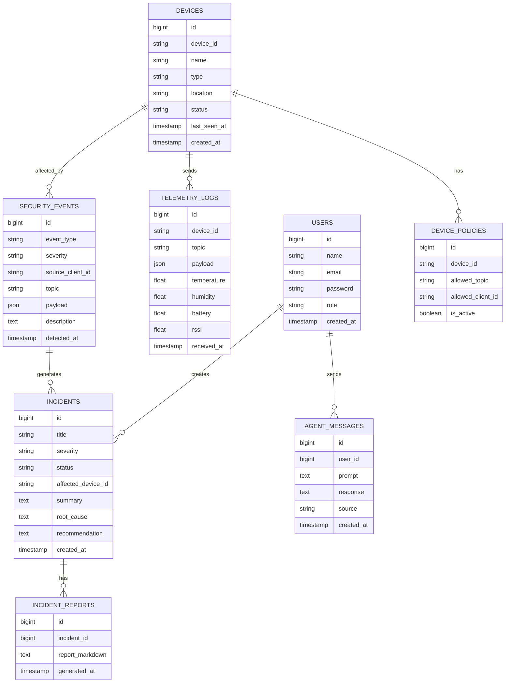
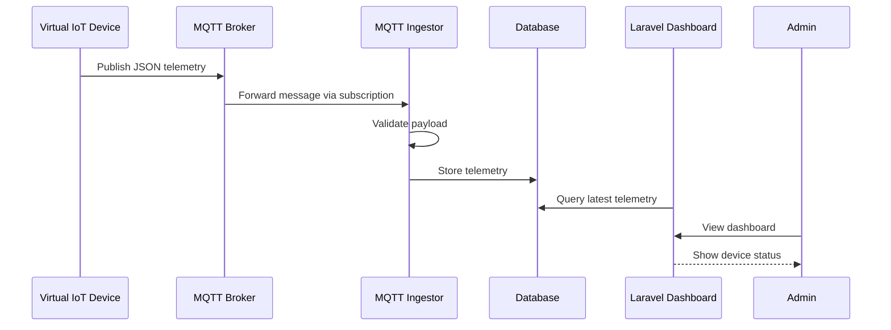
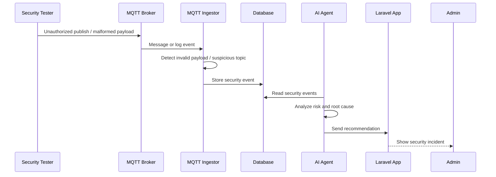
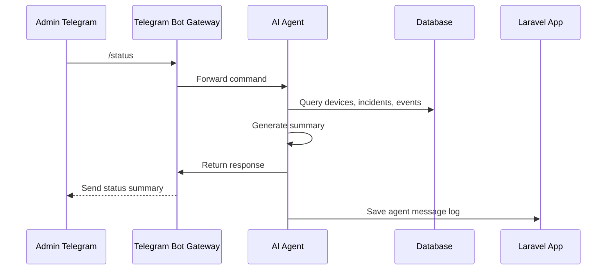
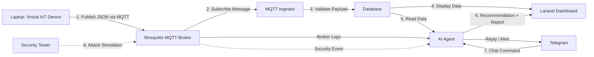

````markdown
# PRD & MVP Plan — Sentinel-IoT

## 1. Nama Project

**Sentinel-IoT**

## 2. Tagline

**AI Agent-Based IoT Security Operation Center pada Infrastruktur MQTT Virtual**

## 3. Deskripsi Singkat

Sentinel-IoT adalah sistem informasi keamanan IoT berbasis **MQTT, Laravel, AI Agent, dan Telegram ChatOps**. Sistem ini dirancang untuk mensimulasikan monitoring dan keamanan infrastruktur IoT tanpa perangkat hardware fisik.

Perangkat IoT digantikan oleh **Virtual IoT Device Simulator** yang berjalan dari laptop mahasiswa. Simulator tersebut mengirim data telemetry dalam format JSON ke **MQTT Broker Mosquitto** yang berjalan pada satu server. Data kemudian diproses, disimpan ke database, ditampilkan pada dashboard Laravel, dan dianalisis oleh AI Agent bergaya OpenClaw/Hermes.

AI Agent bertugas membantu admin dalam melakukan monitoring telemetry, deteksi anomali, audit keamanan MQTT broker, analisis event keamanan, rekomendasi mitigasi, serta pembuatan laporan insiden. Admin dapat berinteraksi melalui dashboard web dan Telegram.

---

# 4. Tujuan Project

## 4.1 Tujuan Utama

Membangun prototype sistem informasi IoT Security Operation Center berbasis satu server yang mampu:

1. Menerima data telemetry dari virtual IoT device melalui MQTT.
2. Menyimpan dan menampilkan data IoT pada dashboard web.
3. Mendeteksi anomali data IoT dan event keamanan MQTT.
4. Mengintegrasikan AI Agent untuk analisis, rekomendasi, dan incident report.
5. Menyediakan interaksi ChatOps melalui Telegram.
6. Mensimulasikan pengujian keamanan seperti unauthorized publish, malformed payload, dan broker scan.

## 4.2 Tujuan Akademik

Project ini menggabungkan beberapa bidang:

- Internet of Things
- Keamanan jaringan
- MQTT pub/sub protocol
- Sistem informasi
- AI Agent
- Telegram ChatOps
- Security monitoring
- Incident management

---

# 5. Problem Statement

Banyak sistem IoT hanya berfokus pada pengiriman data sensor ke dashboard, tetapi belum memiliki mekanisme analisis keamanan, deteksi anomali, dan respons insiden yang mudah dipahami oleh admin.

Selain itu, implementasi IoT sering membutuhkan hardware fisik seperti sensor, ESP32, LoRaWAN gateway, atau microcontroller. Untuk kebutuhan tugas kuliah atau prototype, hal tersebut dapat menjadi hambatan.

Sentinel-IoT menyelesaikan masalah tersebut dengan membuat simulasi IoT berbasis software, lalu menambahkan AI Agent sebagai analis keamanan yang membantu admin memahami kondisi sistem dan potensi serangan.

---

# 6. Scope Project

## 6.1 In Scope

Fitur yang termasuk dalam MVP:

1. Virtual IoT device simulator dari laptop.
2. MQTT Broker menggunakan Eclipse Mosquitto.
3. MQTT authentication sederhana.
4. MQTT topic structure.
5. MQTT ingestor untuk menerima dan memvalidasi payload.
6. Penyimpanan data telemetry.
7. Dashboard Laravel untuk monitoring.
8. Device management.
9. Security event management.
10. Incident management.
11. AI Agent service.
12. Telegram Bot integration.
13. Attack simulator sederhana.
14. AI Agent berbasis Laravel AI SDK.
15. Incident report generator.
15. Mermaid diagram untuk dokumentasi.

## 6.2 Out of Scope untuk MVP

Fitur berikut tidak wajib untuk MVP:

1. Integrasi hardware IoT asli.
2. LoRaWAN fisik.
3. Kubernetes.
4. High availability.
5. TLS MQTT production-ready.
6. Full SIEM seperti Wazuh/ELK.
7. Machine learning anomaly detection kompleks.
8. Real-time map digital twin yang kompleks.
9. Multi-tenant system.
10. Role permission kompleks.

---

# 7. Target User

## 7.1 Admin / End User

Admin adalah pengguna utama yang memantau dashboard, melihat status device, mengecek insiden, dan berinteraksi dengan AI Agent.

## 7.2 Developer / Mahasiswa

Developer menjalankan virtual IoT device simulator dan security tester dari laptop.

## 7.3 AI Agent

AI Agent bertindak sebagai operator analisis yang membaca data telemetry, event keamanan, log, dan incident untuk memberikan rekomendasi.

---

# 8. High-Level Architecture

## 8.1 Arsitektur Umum

```mermaid
flowchart LR
    subgraph LAPTOP["Laptop Mahasiswa / Client"]
        VDEV["Virtual IoT Device Simulator<br/>Python MQTT Publisher"]
        TESTER["Security Tester<br/>MQTTX / Nmap / Attack Script"]
    end

    subgraph SERVER["1 Server / VPS - Docker Compose"]
        MQTT["MQTT Broker<br/>Eclipse Mosquitto"]
        INGESTOR["MQTT Ingestor<br/>Subscriber & Validator"]
        LARAVEL["Laravel App<br/>Dashboard + REST API + Incident Management"]
        DB["PostgreSQL / MySQL<br/>Users, Devices, Incidents, Events"]
        TSDB["InfluxDB Optional<br/>Telemetry Time-Series"]
        AGENT["AI Agent Service<br/>OpenClaw / Hermes-style"]
        TELEGRAM["Telegram Bot Gateway<br/>ChatOps Interface"]
    end

    USER["Admin / End User<br/>Browser + Telegram"]

    VDEV -- "MQTT Publish JSON" --> MQTT
    TESTER -- "Security Test / Attack Simulation" --> MQTT

    MQTT -- "MQTT Subscribe" --> INGESTOR
    INGESTOR -- "Store Telemetry & Events" --> DB
    INGESTOR -- "Store Time-Series Optional" --> TSDB

    LARAVEL -- "Read / Write" --> DB
    LARAVEL -- "Query Telemetry" --> TSDB
    LARAVEL -- "Ask Agent" --> AGENT

    MQTT -- "Broker Logs / Security Events" --> AGENT
    DB -- "Device + Incident Data" --> AGENT
    TSDB -- "Telemetry Data" --> AGENT

    AGENT -- "Recommendation / Incident Report" --> LARAVEL
    TELEGRAM -- "Chat Command" --> AGENT
    AGENT -- "Alert / Reply" --> TELEGRAM

    USER -- "Web Dashboard" --> LARAVEL
    USER -- "Telegram ChatOps" --> TELEGRAM
````

---

# 9. Single Server Deployment Architecture

Untuk tugas kuliah, sistem cukup dijalankan dalam **1 server** menggunakan Docker Compose.

```mermaid
flowchart TB
    subgraph SERVER["1 Server / VPS / Laptop Server"]
        subgraph DOCKER["Docker Compose Host"]
            MQTT["Mosquitto MQTT Broker<br/>Port 1883 / 8883"]
            LARAVEL["Laravel App<br/>Web + API"]
            DB["PostgreSQL / MySQL"]
            INGESTOR["MQTT Ingestor Service"]
            AGENT["AI Agent Service"]
            BOT["Telegram Bot Gateway"]
            REDIS["Redis Optional<br/>Queue / Cache"]
        end
    end

    LAPTOP["Laptop Mahasiswa<br/>Virtual IoT + Security Tester"]
    USER["Admin<br/>Browser / Telegram"]

    LAPTOP -- "MQTT Publish / Test" --> MQTT
    MQTT --> INGESTOR
    INGESTOR --> DB
    LARAVEL --> DB
    LARAVEL --> AGENT
    BOT --> AGENT
    USER --> LARAVEL
    USER --> BOT
```

---

# 10. Recommended Tech Stack

## 10.1 Core Stack

| Layer                   | Technology                                              |
| ----------------------- | ------------------------------------------------------- |
| Web App                 | Laravel 13                                              |
| SPA Layer               | Inertia.js v3                                           |
| Frontend Framework      | React 19 + TypeScript                                   |
| UI Components           | shadcn/ui (Radix UI + Tailwind v4)                      |
| Icons                   | lucide-react                                            |
| Data Tables             | TanStack Table v8 via shadcn data-table                 |
| Charts                  | Recharts                                                |
| Toasts                  | sonner                                                  |
| Markdown                | react-markdown                                          |
| Date Utilities          | date-fns                                                |
| Forms                   | Inertia `useForm` + `<Form>` (zod + react-hook-form for complex client-only forms) |
| Type-safe Routes        | Laravel Wayfinder                                       |
| Backend API             | Laravel REST API + Sanctum                              |
| MQTT Broker             | Eclipse Mosquitto                                       |
| Virtual IoT Device      | Python                                                  |
| MQTT Client             | paho-mqtt                                               |
| MQTT Ingestor           | Python                                                  |
| AI Agent                | Laravel AI SDK (`laravel/ai`)                           |
| LLM Providers           | OpenAI / Anthropic / Gemini (configurable)              |
| Telegram Bot            | Python (python-telegram-bot)                            |
| Database                | PostgreSQL atau MySQL                                   |
| Optional Time-Series DB | InfluxDB                                                |
| Deployment              | Docker Compose                                          |
| Security Testing        | MQTTX, Nmap, custom Python attack script                |

## 10.2 Rekomendasi Final

Untuk MVP, gunakan:

```text
Laravel 13 + Inertia.js v3 + React 19 + TypeScript
shadcn/ui + Tailwind v4 + lucide-react
Recharts (telemetry visualization)
sonner (toast notifications)
react-markdown (incident report rendering)
Laravel Wayfinder (type-safe routes)
PostgreSQL
Mosquitto MQTT Broker
Laravel AI SDK (laravel/ai) untuk AI Agent in-process
Python MQTT Device Simulator
Python MQTT Ingestor
Python Telegram Bot
Docker Compose
```

InfluxDB bersifat optional. Jika ingin lebih sederhana, telemetry bisa disimpan langsung ke PostgreSQL.

AI Agent dijalankan **in-process** di dalam Laravel app menggunakan paket `laravel/ai`. Tidak perlu container terpisah; Laravel langsung memanggil provider LLM (OpenAI / Anthropic / Gemini) lewat SDK ini.

---

# 11. Server Specification

## 11.1 Minimum

```text
CPU      : 2 Core
RAM      : 4 GB
Storage  : 30 GB SSD
OS       : Ubuntu Server 22.04 / 24.04
Runtime  : Docker + Docker Compose
```

## 11.2 Recommended

```text
CPU      : 4 Core
RAM      : 8 GB
Storage  : 80 GB SSD
OS       : Ubuntu Server 24.04 LTS
Runtime  : Docker + Docker Compose
```

## 11.3 Notes

Untuk AI Agent, disarankan menggunakan API eksternal seperti OpenAI, Gemini, Claude, atau model LLM lain agar server tidak berat.

---

# 12. Main Modules

## 12.1 Virtual IoT Device Simulator

### Deskripsi

Simulator berjalan dari laptop mahasiswa dan berperan sebagai pengganti perangkat IoT fisik.

### Fungsi

* Generate telemetry JSON.
* Publish data ke MQTT broker.
* Mensimulasikan beberapa jenis device.
* Mensimulasikan kondisi normal dan abnormal.

### Device Virtual

| Device ID       | Type               | Data                                 |
| --------------- | ------------------ | ------------------------------------ |
| temp-sensor-001 | Temperature Sensor | temperature, humidity, battery, rssi |
| door-lock-001   | Door Lock          | door_status, access_status, battery  |
| power-meter-001 | Power Meter        | voltage, current, power_usage        |
| air-quality-001 | Air Quality        | co2, pm25, temperature               |
| water-leak-001  | Water Leak Sensor  | leak_status, water_level             |

### Example Payload

```json
{
  "device_id": "temp-sensor-001",
  "type": "temperature_sensor",
  "location": "lab-a",
  "temperature": 29.4,
  "humidity": 72,
  "battery": 88,
  "rssi": -76,
  "status": "normal",
  "timestamp": "2026-05-15T10:00:00+07:00"
}
```

---

## 12.2 MQTT Broker

### Deskripsi

MQTT Broker menggunakan Eclipse Mosquitto sebagai pusat komunikasi publish/subscribe.

### Requirement

* Port 1883 untuk MQTT.
* Optional port 8883 untuk MQTT TLS.
* Authentication aktif.
* ACL dasar.
* Broker logging aktif.

### Topic Structure

```text
iot/{building}/{room}/{device_id}/telemetry
iot/{building}/{room}/{device_id}/event
iot/{building}/{room}/{device_id}/command
security/mqtt/events
sentinel/agent/commands
```

### Example Topics

```text
iot/building-a/lab-a/temp-sensor-001/telemetry
iot/building-a/lab-a/door-lock-001/event
iot/building-a/server-room/power-meter-001/telemetry
security/mqtt/events
```

---

## 12.3 MQTT Ingestor

### Deskripsi

MQTT Ingestor adalah service subscriber yang membaca data dari broker, memvalidasi payload, lalu menyimpan ke database.

### Fungsi

* Subscribe ke topic telemetry.
* Parse topic.
* Validate JSON.
* Validate required fields.
* Save telemetry.
* Save device last seen.
* Detect malformed payload.
* Create security event jika payload invalid.

### Subscribe Topic

```text
iot/+/+/+/telemetry
iot/+/+/+/event
```

### Validation Rule

Payload telemetry wajib memiliki:

```text
device_id
type
timestamp
location
```

Jika tidak valid, buat event:

```text
event_type = malformed_payload
severity = medium
```

---

## 12.4 Laravel App

### Deskripsi

Laravel App adalah sistem informasi utama.

### Fungsi

* Dashboard monitoring IoT.
* Device management.
* Telemetry viewer.
* Security event management.
* Incident management.
* AI Agent console.
* Telegram command log.
* Report center.
* Policy center.

### Recommended Admin Panel

Gunakan **Inertia.js v3 + React 19 + shadcn/ui** sebagai admin panel. Stack ini sudah ter-bundle pada starter kit dan menyediakan komponen siap pakai (Card, Table, Dialog, DropdownMenu, Sheet, Tabs, Badge) yang dibangun di atas Radix UI dan Tailwind v4.

#### Frontend Stack Detail

| Kebutuhan UI              | Library                              |
| ------------------------- | ------------------------------------ |
| Component primitives      | shadcn/ui (button, card, table, dialog, sheet, tabs, badge, input, select, dropdown-menu) |
| Icons                     | lucide-react                         |
| Data tables (devices, telemetry, events, incidents) | shadcn data-table + TanStack Table v8 |
| Charts (telemetry trend, dashboard sparkline)       | Recharts                             |
| Toast / notification      | sonner                               |
| Markdown rendering (incident report)                | react-markdown + remark-gfm          |
| Date formatting           | date-fns                             |
| Form state                | Inertia v3 `useForm` & `<Form>` component |
| Route helpers             | Laravel Wayfinder (`@/actions`, `@/routes`) |

Komponen shadcn di-generate via CLI ke `resources/js/components/ui/` dan dikomposisikan menjadi komponen domain (mis. `severity-badge.tsx`, `device-status-card.tsx`, `telemetry-chart.tsx`).

---

## 12.5 AI Agent Service

### Deskripsi

AI Agent berjalan **in-process** di dalam Laravel app menggunakan paket [`laravel/ai`](https://laravel.com/docs/13.x/ai-sdk). Tidak ada service Python terpisah, tidak ada FastAPI, tidak ada container tambahan. Laravel langsung memanggil provider LLM (OpenAI / Anthropic / Gemini) lewat SDK.

### Gaya Agent

Agent mengikuti **OpenClaw / Hermes-style pattern** — tool-enabled, memory-aware, approval-gated. Pattern ini di-implementasikan secara native lewat Laravel AI SDK; tidak ada dependency ke produk OpenClaw atau Hermes.

* Setiap agent adalah PHP class di `app/Ai/Agents/` yang mengimplementasikan kontrak `Laravel\Ai\Contracts\Agent`.
* Agent menggunakan trait `RemembersConversations` agar history percakapan otomatis disimpan ke tabel `agent_conversations` + `agent_conversation_messages` (di-publish oleh SDK).
* Tools adalah PHP class di `app/Ai/Tools/` yang mengimplementasikan `Laravel\Ai\Contracts\Tool`.
* Bisa dipanggil dari controller (`(new SentinelAgent)->prompt(...)`) untuk dashboard web, atau dari Telegram bot lewat REST API, atau di-queue lewat `queue()` method.
* Bisa membuat rekomendasi dan incident report (lewat structured output / `HasStructuredOutput` interface).
* Tidak melakukan aksi destruktif tanpa approval admin.

### Agents yang Dibuat untuk MVP

| Class                          | Tujuan                                                  |
| ------------------------------ | ------------------------------------------------------- |
| `App\Ai\Agents\SentinelAgent`   | General Q&A: status, anomali, ringkasan keamanan        |
| `App\Ai\Agents\IncidentAnalyst` | Structured-output incident report generator (markdown + recommendations) |
| `App\Ai\Agents\AuditAgent`      | MQTT broker audit (ACL vs security events)              |

### Agent Tools

Tools didefinisikan sebagai PHP class. Setiap tool punya `description()`, `handle(Request $request)`, dan `schema(JsonSchema $schema)`.

```text
App\Ai\Tools\GetDeviceStatus
App\Ai\Tools\GetRecentTelemetry
App\Ai\Tools\GetSecurityEvents
App\Ai\Tools\GetOpenIncidents
App\Ai\Tools\AnalyzeAnomaly
App\Ai\Tools\AuditMqttBroker
App\Ai\Tools\GenerateIncidentReport
App\Ai\Tools\RecommendMitigation
App\Ai\Tools\SendTelegramAlert
```

### Example Agent Class

```php
<?php

namespace App\Ai\Agents;

use App\Ai\Tools\GetDeviceStatus;
use App\Ai\Tools\GetSecurityEvents;
use App\Ai\Tools\GetOpenIncidents;
use Laravel\Ai\Attributes\MaxSteps;
use Laravel\Ai\Attributes\Provider;
use Laravel\Ai\Concerns\RemembersConversations;
use Laravel\Ai\Contracts\Agent;
use Laravel\Ai\Contracts\Conversational;
use Laravel\Ai\Contracts\HasTools;
use Laravel\Ai\Enums\Lab;
use Laravel\Ai\Promptable;

#[Provider(Lab::OpenAI)]
#[MaxSteps(6)]
class SentinelAgent implements Agent, Conversational, HasTools
{
    use Promptable, RemembersConversations;

    public function instructions(): string
    {
        return file_get_contents(resource_path('ai/prompts/sentinel-system.md'));
    }

    public function tools(): iterable
    {
        return [
            new GetDeviceStatus,
            new GetSecurityEvents,
            new GetOpenIncidents,
        ];
    }
}
```

### Example Prompt to Agent

```text
Cek status seluruh device IoT dan jelaskan apakah ada anomali atau event keamanan kritis.
```

### Example Response

```text
Status Sistem:
- Total device: 5
- Online: 4
- Offline: 1
- Security events hari ini: 3
- Critical incident: 1

Temuan:
Device temp-sensor-001 mengirim payload suhu abnormal sebesar 88°C.
Terdapat unauthorized publish dari client_id attacker-client.

Rekomendasi:
1. Validasi ACL topic.
2. Blokir client_id attacker-client.
3. Rotasi credential device terkait.
4. Buat incident dengan severity High.
```

### Catatan Migrasi

Laravel AI SDK ships migration `agent_conversations` dan `agent_conversation_messages` (untuk conversation memory). Tabel `agent_messages` yang dibuat di Phase 3a tetap dipakai sebagai **dashboard feed / audit log** yang menyimpan satu baris per interaksi user (web, telegram, system) lengkap dengan metadata. Dua tabel ini saling melengkapi: SDK mengelola context window, `agent_messages` mengelola jejak audit yang bisa difilter per source.

---

## 12.6 Telegram Bot Gateway

### Deskripsi

Telegram digunakan sebagai ChatOps interface untuk admin.

### Fungsi

* Menerima command dari admin.
* Mengirim command ke AI Agent.
* Mengirim alert otomatis.
* Mengirim hasil audit.
* Mengirim incident summary.

### Command MVP

```text
/start
/status
/devices
/incidents
/security
/audit
/report
/help
```

### Example Command

```text
/status
```

### Example Reply

```text
Sentinel-IoT Status:
- MQTT Broker: Online
- Device aktif: 4/5
- Security event hari ini: 3
- Incident terbuka: 1
- Risk level: Medium
```

---

## 12.7 Security Tester

### Deskripsi

Security tester berjalan dari laptop mahasiswa untuk menguji broker MQTT.

### Test Case

1. Unauthorized publish.
2. Wrong credential.
3. Malformed JSON.
4. Device spoofing.
5. Publish flood sederhana.
6. Port scanning dengan Nmap.

### Example Malformed Payload

```json
{
  "device": "unknown",
  "temp": "not-a-number"
}
```

### Example Unauthorized Publish

```text
Topic:
iot/building-a/lab-a/temp-sensor-001/telemetry

Client:
attacker-client
```

Expected result:

* Broker menolak jika ACL aktif.
* Jika berhasil, sistem membuat security event.

---

# 13. Database Design

## 13.1 ERD Overview



---

## 13.2 Tables

### users

```text
id
name
email
password
role
created_at
updated_at
```

### devices

```text
id
device_id
name
type
location
status
last_seen_at
metadata_json
created_at
updated_at
```

### telemetry_logs

```text
id
device_id
topic
payload_json
temperature
humidity
battery
rssi
received_at
created_at
```

### security_events

```text
id
event_type
severity
source_client_id
topic
payload_json
description
detected_at
created_at
```

### incidents

```text
id
title
severity
status
affected_device_id
summary
root_cause
recommendation
created_at
updated_at
```

### incident_reports

```text
id
incident_id
report_markdown
generated_by
generated_at
created_at
```

### agent_messages

```text
id
user_id
source
prompt
response
metadata_json
created_at
```

### device_policies

```text
id
device_id
allowed_client_id
allowed_topic
can_publish
can_subscribe
is_active
created_at
updated_at
```

---

# 14. API Design

## 14.1 Laravel API Endpoints

### Dashboard

```http
GET /api/dashboard/summary
```

Response:

```json
{
  "total_devices": 5,
  "online_devices": 4,
  "offline_devices": 1,
  "security_events_today": 3,
  "open_incidents": 1,
  "risk_level": "medium"
}
```

---

### Devices

```http
GET /api/devices
GET /api/devices/{device_id}
POST /api/devices
PUT /api/devices/{device_id}
DELETE /api/devices/{device_id}
```

---

### Telemetry

```http
GET /api/telemetry
GET /api/telemetry/{device_id}
GET /api/telemetry/{device_id}/latest
```

---

### Security Events

```http
GET /api/security-events
GET /api/security-events/{id}
POST /api/security-events
```

---

### Incidents

```http
GET /api/incidents
GET /api/incidents/{id}
POST /api/incidents
PUT /api/incidents/{id}
POST /api/incidents/{id}/generate-report
```

---

### AI Agent

```http
POST /api/agent/ask
POST /api/agent/audit
POST /api/agent/analyze-incident/{id}
POST /api/agent/recommendation
```

Example request:

```json
{
  "prompt": "Cek status semua device dan jelaskan risiko keamanan terbaru."
}
```

Example response:

```json
{
  "response": "Terdapat 1 device offline dan 2 event keamanan medium...",
  "recommendations": [
    "Cek ACL pada broker MQTT",
    "Validasi client_id dari device temp-sensor-001"
  ]
}
```

---

# 15. Workflow Detail

## 15.1 Normal Telemetry Flow



---

## 15.2 Security Event Flow



---

## 15.3 Telegram ChatOps Flow



---

# 16. MVP Features

## 16.1 MVP Feature List

| Feature                      | Priority     | Status   |
| ---------------------------- | ------------ | -------- |
| Docker Compose environment   | Must Have    | Planned  |
| Mosquitto MQTT Broker        | Must Have    | Planned  |
| Virtual IoT Device Simulator | Must Have    | Planned  |
| MQTT Ingestor                | Must Have    | Planned  |
| Laravel Dashboard            | Must Have    | Planned  |
| Device Management            | Must Have    | Planned  |
| Telemetry Logs               | Must Have    | Planned  |
| Security Events              | Must Have    | Planned  |
| Incident Management          | Must Have    | Planned  |
| AI Agent Ask                 | Must Have    | Planned  |
| Telegram Bot Basic Commands  | Should Have  | Planned  |
| Attack Simulator             | Should Have  | Planned  |
| Incident Report Generator    | Should Have  | Planned  |
| InfluxDB Time-Series         | Nice to Have | Optional |
| Grafana                      | Nice to Have | Optional |
| TLS MQTT                     | Nice to Have | Optional |

---

# 17. MVP User Stories

## 17.1 Admin Dashboard

```text
Sebagai admin,
saya ingin melihat jumlah device aktif, offline, security event, dan incident,
agar saya dapat memahami kondisi sistem IoT secara cepat.
```

Acceptance Criteria:

* Dashboard menampilkan total devices.
* Dashboard menampilkan online/offline devices.
* Dashboard menampilkan security events hari ini.
* Dashboard menampilkan open incidents.

---

## 17.2 Virtual IoT Telemetry

```text
Sebagai developer,
saya ingin menjalankan virtual IoT device dari laptop,
agar saya dapat mengirim data sensor tanpa hardware fisik.
```

Acceptance Criteria:

* Script simulator dapat publish telemetry JSON.
* Data masuk ke MQTT broker.
* Data muncul di dashboard.

---

## 17.3 Security Event Detection

```text
Sebagai admin,
saya ingin sistem mendeteksi payload tidak valid atau topic mencurigakan,
agar potensi serangan MQTT dapat diketahui.
```

Acceptance Criteria:

* Malformed payload menghasilkan security event.
* Unauthorized topic publish menghasilkan security event.
* Event memiliki severity.

---

## 17.4 AI Agent Analysis

```text
Sebagai admin,
saya ingin bertanya ke AI Agent tentang status sistem,
agar saya mendapatkan analisis dan rekomendasi secara natural language.
```

Acceptance Criteria:

* Admin dapat mengirim prompt ke AI Agent.
* Agent membaca data device, telemetry, dan security event.
* Agent mengembalikan ringkasan dan rekomendasi.

---

## 17.5 Telegram ChatOps

```text
Sebagai admin,
saya ingin menerima status dan alert melalui Telegram,
agar saya dapat memonitor sistem tanpa membuka dashboard.
```

Acceptance Criteria:

* Command `/status` berjalan.
* Command `/incidents` berjalan.
* Bot dapat mengirim alert security event.

---

# 18. Build Roadmap

## Phase 0 — Project Setup

### Goal

Menyiapkan struktur repository dan Docker environment.

### Tasks

* Buat repository.
* Buat folder structure.
* Setup Docker Compose.
* Setup Mosquitto container.
* Setup Laravel container.
* Setup PostgreSQL container.
* Setup Python service container.

### Output

* Project bisa dijalankan dengan:

```bash
docker compose up -d
```

---

## Phase 1 — MQTT Broker & Device Simulator

### Goal

Membuat jalur komunikasi MQTT dari laptop ke server.

### Tasks

* Setup Mosquitto.
* Buat user/password MQTT.
* Buat topic convention.
* Buat Python virtual device simulator.
* Publish sample payload.
* Test dengan MQTTX.

### Output

* Data telemetry berhasil masuk ke MQTT broker.

---

## Phase 2 — MQTT Ingestor

### Goal

Membaca data dari broker dan menyimpannya ke database.

### Tasks

* Buat Python MQTT subscriber.
* Subscribe topic telemetry.
* Validate JSON.
* Store to database.
* Update device last_seen.
* Detect malformed payload.

### Output

* Telemetry tersimpan di database.
* Payload invalid menjadi security event.

---

## Phase 3 — Laravel System Information

### Goal

Membuat dashboard sistem informasi berbasis Inertia React + shadcn/ui.

### Tasks

* Setup Laravel + Inertia v3 + React 19 (sudah ter-bundle starter kit).
* Inisialisasi shadcn/ui CLI dan install komponen dasar (`button`, `card`, `table`, `dialog`, `sheet`, `tabs`, `badge`, `input`, `select`, `dropdown-menu`, `sonner`).
* Install dependency tambahan: `recharts`, `react-markdown`, `remark-gfm`, `date-fns`, `lucide-react`, `@tanstack/react-table`.
* Buat migration untuk semua tabel di §13.2.
* Buat model + factory + seeder.
* Buat Inertia controller + page untuk dashboard summary.
* Buat resource pages: devices (index/show), telemetry, security events, incidents (index/show), agent console.
* Buat layout sidebar dengan navigasi ke setiap halaman.
* Buat REST API endpoints di `routes/api.php` dengan Sanctum auth untuk dipanggil dari Python services.

### Output

* Admin dapat melihat device, telemetry, security event, dan incident lewat halaman Inertia React.
* REST API tersedia untuk AI Agent dan Telegram Bot.

---

## Phase 4 — AI Agent (Laravel AI SDK)

### Goal

Membuat AI Agent in-process di dalam Laravel app menggunakan paket `laravel/ai`. Tidak ada container terpisah.

### Tasks

* `composer require laravel/ai`.
* `php artisan vendor:publish --provider="Laravel\Ai\AiServiceProvider"` untuk men-generate `config/ai.php` dan migrasi `agent_conversations` + `agent_conversation_messages`.
* `php artisan migrate`.
* Set `OPENAI_API_KEY` (atau `ANTHROPIC_API_KEY` / `GEMINI_API_KEY`) di `.env`.
* Buat tools di `app/Ai/Tools/`: `GetDeviceStatus`, `GetRecentTelemetry`, `GetSecurityEvents`, `GetOpenIncidents`, `AuditMqttBroker`, `GenerateIncidentReport`, `RecommendMitigation`.
* Buat agent classes di `app/Ai/Agents/`:
  - `SentinelAgent` (general Q&A, conversational + tools)
  - `IncidentAnalyst` (structured output: report markdown + recommendations)
  - `AuditAgent` (MQTT broker audit)
* Simpan system prompt sebagai markdown file di `resources/ai/prompts/sentinel-system.md` dan baca lewat `instructions()`.
* Update `AgentController` untuk memanggil agent: `(new SentinelAgent)->forUser($user)->prompt($input)`. Persist hasil ke tabel `agent_messages` sebagai audit feed (selain conversation memory yang ditangani SDK).
* Tambah Inertia React UI di `agent/index.tsx` untuk menampilkan history `agent_messages`, kirim prompt baru, dan tampilkan response (gunakan komponen shadcn/ui yang sudah ada di Phase 3b).
* Pest feature test untuk `AgentController@ask` (mock provider lewat fake / test double SDK).

### Output

* Admin dapat bertanya ke AI Agent dari dashboard Laravel.
* AI Agent membaca data device, telemetry, security event, incident lewat tools.
* Conversation history tersimpan di `agent_conversations` (memory) dan `agent_messages` (audit).

---

## Phase 5 — Telegram Bot

### Goal

Membuat ChatOps interface.

### Tasks

* Buat Telegram Bot.
* Setup bot token.
* Buat command `/status`.
* Buat command `/devices`.
* Buat command `/incidents`.
* Buat command `/audit`.
* Kirim command ke AI Agent.
* Simpan log chat ke database.

### Output

* Admin dapat berinteraksi dengan sistem via Telegram.

---

## Phase 6 — Security Tester

### Goal

Mensimulasikan serangan MQTT.

### Tasks

* Buat script unauthorized publish.
* Buat script malformed payload.
* Buat script device spoofing.
* Buat script publish flood sederhana.
* Integrasikan hasil test ke dashboard.
* AI Agent membuat rekomendasi.

### Output

* Sistem dapat mendeteksi dan menampilkan security event.

---

## Phase 7 — Final Demo & Documentation

### Goal

Menyiapkan demo dan laporan.

### Tasks

* Buat final workflow diagram.
* Buat README.
* Buat demo scenario.
* Buat sample data.
* Buat presentation script.
* Buat final report.

### Output

* Project siap dipresentasikan.

---

# 19. Folder Structure Recommendation

```text
sentinel-iot/
├── docker-compose.yml
├── .env.example
├── README.md
├── docs/
│   ├── PRD.md
│   ├── MVP.md
│   ├── ARCHITECTURE.md
│   ├── API.md
│   ├── DATABASE.md
│   └── DEMO_SCENARIO.md
├── mosquitto/
│   ├── config/
│   │   ├── mosquitto.conf
│   │   ├── aclfile
│   │   └── passwordfile
│   └── logs/
├── laravel-app/
│   ├── app/
│   │   ├── Ai/
│   │   │   ├── Agents/         # SentinelAgent, IncidentAnalyst, AuditAgent
│   │   │   └── Tools/          # GetDeviceStatus, GetRecentTelemetry, ...
│   │   ├── Http/
│   │   └── Models/
│   ├── resources/
│   │   ├── ai/prompts/         # markdown system prompts
│   │   └── js/
│   └── ...
├── services/
│   ├── mqtt-ingestor/
│   │   ├── app.py
│   │   ├── requirements.txt
│   │   └── Dockerfile
│   ├── telegram-bot/
│   │   ├── bot.py
│   │   ├── requirements.txt
│   │   └── Dockerfile
│   └── attack-simulator/
│       ├── unauthorized_publish.py
│       ├── malformed_payload.py
│       ├── spoof_device.py
│       └── publish_flood.py
└── simulator/
    ├── virtual_devices.py
    ├── device_profiles.json
    └── requirements.txt
```

Tidak ada folder `services/ai-agent/` lagi. AI Agent hidup di dalam Laravel app sebagai `App\Ai\Agents\*` dan `App\Ai\Tools\*`.

---

# 20. Docker Compose Services

## 20.1 Services

```yaml
services:
  mosquitto:
    image: eclipse-mosquitto
    container_name: sentinel-mosquitto
    ports:
      - "1883:1883"
    volumes:
      - ./mosquitto/config:/mosquitto/config
      - ./mosquitto/logs:/mosquitto/log

  postgres:
    image: postgres:16
    container_name: sentinel-postgres
    environment:
      POSTGRES_DB: sentinel_iot
      POSTGRES_USER: sentinel
      POSTGRES_PASSWORD: sentinel_password
    ports:
      - "5432:5432"

  laravel-app:
    build: ./laravel-app
    container_name: sentinel-laravel
    ports:
      - "8000:8000"
    depends_on:
      - postgres
      - mosquitto

  mqtt-ingestor:
    build: ./services/mqtt-ingestor
    container_name: sentinel-mqtt-ingestor
    depends_on:
      - mosquitto
      - postgres

  telegram-bot:
    build: ./services/telegram-bot
    container_name: sentinel-telegram-bot
    depends_on:
      - laravel-app
```

Tidak ada service `ai-agent` di docker-compose. AI Agent di-host langsung oleh `laravel-app` lewat paket `laravel/ai`.

---

# 21. Environment Variables

```env
APP_NAME=Sentinel-IoT
APP_ENV=local
APP_URL=http://localhost:8000

DB_CONNECTION=pgsql
DB_HOST=postgres
DB_PORT=5432
DB_DATABASE=sentinel_iot
DB_USERNAME=sentinel
DB_PASSWORD=sentinel_password

MQTT_HOST=mosquitto
MQTT_PORT=1883
MQTT_USERNAME=sentinel_device
MQTT_PASSWORD=sentinel_mqtt_password

# Laravel AI SDK provider keys (only set the one(s) you use)
OPENAI_API_KEY=
ANTHROPIC_API_KEY=
GEMINI_API_KEY=

TELEGRAM_BOT_TOKEN=
TELEGRAM_ADMIN_CHAT_ID=
```

---

# 22. AI Agent Prompt Specification

Sistem prompt disimpan sebagai markdown di `resources/ai/prompts/sentinel-system.md` dan dibaca oleh agent class lewat `instructions()`. Format incident report dipakai oleh `IncidentAnalyst` agent yang punya `HasStructuredOutput` schema (markdown + array of recommendations).

## 22.1 System Prompt

```text
You are Sentinel-IoT AI Agent, an IoT Security Operation Center assistant.

Your responsibilities:
1. Analyze IoT telemetry.
2. Detect anomalies.
3. Review MQTT security events.
4. Explain incidents in simple language.
5. Recommend mitigation.
6. Generate incident reports.
7. Avoid executing destructive actions without admin approval.

You have access to tools:
- get_device_status
- get_recent_telemetry
- get_security_events
- get_open_incidents
- audit_mqtt_broker
- generate_incident_report
- send_telegram_alert

Always provide:
- summary
- findings
- severity
- recommendation
- next action
```

---

## 22.2 Incident Report Format

```markdown
# Incident Report

## Incident ID
INC-YYYY-NNN

## Severity
Low / Medium / High / Critical

## Summary
Ringkasan insiden.

## Timeline
- timestamp: event

## Affected Device
device_id

## Evidence
- MQTT topic
- payload
- client_id
- log/event

## Root Cause Analysis
Analisis penyebab.

## Impact
Dampak terhadap sistem.

## Recommendation
Langkah mitigasi.

## Status
Open / Investigating / Resolved
```

---

# 23. Demo Scenario

## Scenario 1 — Normal Telemetry

### Steps

1. Jalankan server.
2. Jalankan virtual device simulator dari laptop.
3. Device publish telemetry.
4. Dashboard menampilkan data device.
5. Admin bertanya ke AI Agent: “Cek status device.”

### Expected Result

AI Agent menjawab status device normal.

---

## Scenario 2 — Malformed Payload Attack

### Steps

1. Jalankan script malformed payload.
2. Payload tidak valid dikirim ke broker.
3. MQTT Ingestor mendeteksi payload invalid.
4. Security event dibuat.
5. AI Agent menganalisis event.
6. Dashboard menampilkan security event.

### Expected Result

Security event severity medium dibuat.

---

## Scenario 3 — Unauthorized Publish

### Steps

1. Jalankan attacker script.
2. Script publish ke topic device lain.
3. Broker atau ingestor mendeteksi mismatch.
4. Sistem membuat event topic spoofing.
5. AI Agent membuat rekomendasi.

### Expected Result

Incident dibuat dengan severity high jika publish berhasil.

---

## Scenario 4 — Telegram Status

### Steps

1. Admin membuka Telegram.
2. Admin mengetik `/status`.
3. Telegram Bot mengirim request ke AI Agent.
4. Agent membaca database.
5. Bot mengirim ringkasan status.

### Expected Result

Admin menerima status sistem via Telegram.

---

# 24. Acceptance Criteria MVP

MVP dianggap selesai jika:

1. Virtual IoT device dapat publish MQTT dari laptop.
2. Mosquitto broker menerima data.
3. MQTT ingestor dapat subscribe dan menyimpan data.
4. Laravel dashboard menampilkan device dan telemetry.
5. Security event dapat dibuat dari payload invalid.
6. Incident dapat dibuat dan dikelola.
7. AI Agent dapat menjawab status sistem.
8. AI Agent dapat memberi rekomendasi keamanan.
9. Telegram Bot dapat menjalankan minimal `/status`.
10. Demo unauthorized publish atau malformed payload berhasil.
11. Dokumentasi arsitektur dan workflow tersedia.

---

# 25. Non-Functional Requirements

## 25.1 Security

* MQTT authentication wajib aktif.
* Database tidak dibuka ke publik.
* Admin dashboard menggunakan login.
* Telegram command dibatasi untuk admin chat ID.
* AI Agent tidak melakukan aksi destruktif tanpa approval.

## 25.2 Performance

* Mendukung minimal 5 virtual devices.
* Publish interval minimal 5 detik.
* Dashboard dapat menampilkan data terbaru.
* Agent response maksimal reasonable untuk demo.

## 25.3 Reliability

* Service berjalan via Docker Compose.
* Jika ingestor restart, data baru tetap bisa diterima.
* Broker log disimpan.

## 25.4 Maintainability

* Setiap service dipisahkan foldernya.
* Konfigurasi melalui `.env`.
* README wajib menjelaskan cara run.

---

# 26. Risk & Mitigation

| Risk                           | Impact                  | Mitigation                          |
| ------------------------------ | ----------------------- | ----------------------------------- |
| Scope terlalu besar            | Project tidak selesai   | Fokus MVP                           |
| AI Agent sulit dibuat          | Fitur utama lambat      | Mulai dari rule-based + LLM summary |
| MQTT auth/ACL ribet            | Demo security terganggu | Mulai auth basic dulu               |
| Telegram integration error     | ChatOps tidak jalan     | Jadikan optional setelah dashboard  |
| InfluxDB menambah kompleksitas | Setup berat             | Pakai PostgreSQL dulu               |
| LLM API mahal                  | Biaya                   | Batasi prompt dan gunakan mock mode |

---

# 27. Recommended MVP Simplification

Jika waktu terbatas, gunakan versi paling sederhana:

```text
Laptop:
- Python virtual device simulator
- Python attack simulator

Server:
- Mosquitto
- Laravel 13 + Inertia React + shadcn/ui + Laravel AI SDK
- PostgreSQL
- Python MQTT ingestor
- Telegram Bot optional
```

Tidak perlu:

```text
InfluxDB
Grafana
TLS
Wazuh
Kubernetes
Advanced ML
```

---

# 28. Task Breakdown for AI Coding Agent

## 28.1 Setup Repository

```text
Create project folder sentinel-iot.
Create docker-compose.yml.
Create folders:
- mosquitto
- laravel-app
- services/mqtt-ingestor
- services/ai-agent
- services/telegram-bot
- simulator
- docs
```

## 28.2 Mosquitto Setup

```text
Create mosquitto.conf.
Enable listener 1883.
Disable anonymous access.
Add passwordfile.
Add aclfile.
Enable logging.
```

## 28.3 Laravel Setup

```text
Laravel 13 + Inertia v3 + React 19 (already wired in starter kit).
Configure PostgreSQL.
Create migrations:
- devices
- telemetry_logs
- security_events
- incidents
- incident_reports
- agent_messages
- device_policies
Create Eloquent models, factories, seeders.
Initialize shadcn/ui:
- npx shadcn@latest init
- npx shadcn@latest add button card table dialog sheet tabs badge input select dropdown-menu sonner
Install additional UI libraries:
- npm install recharts react-markdown remark-gfm date-fns lucide-react @tanstack/react-table
Create Inertia controllers + pages:
- DashboardController -> dashboard.tsx
- DeviceController -> devices/index.tsx, devices/show.tsx
- TelemetryController -> telemetry/index.tsx
- SecurityEventController -> security-events/index.tsx
- IncidentController -> incidents/index.tsx, incidents/show.tsx
- AgentController -> agent/index.tsx
Create REST API controllers under app/Http/Controllers/Api/ with Sanctum auth.
Create API resources and form requests.
Regenerate Wayfinder route helpers.
```

## 28.4 MQTT Ingestor

```text
Build Python service using paho-mqtt.
Connect to broker.
Subscribe to iot/+/+/+/telemetry and event.
Validate JSON.
Store valid telemetry.
Create security event for invalid payload.
```

## 28.5 Simulator

```text
Build Python virtual device simulator.
Support multiple device profiles.
Publish JSON telemetry every 5 seconds.
Support anomaly mode.
```

## 28.6 Attack Simulator

```text
Create scripts:
- unauthorized_publish.py
- malformed_payload.py
- spoof_device.py
- publish_flood.py
```

## 28.7 AI Agent

```text
composer require laravel/ai.
php artisan vendor:publish --provider="Laravel\Ai\AiServiceProvider".
php artisan migrate (creates agent_conversations + agent_conversation_messages).
Set OPENAI_API_KEY (or ANTHROPIC_API_KEY / GEMINI_API_KEY) in .env.
Create tool classes under app/Ai/Tools/:
- GetDeviceStatus
- GetRecentTelemetry
- GetSecurityEvents
- GetOpenIncidents
- AuditMqttBroker
- GenerateIncidentReport
- RecommendMitigation
Create agent classes under app/Ai/Agents/:
- SentinelAgent (Conversational + HasTools, uses RemembersConversations)
- IncidentAnalyst (HasStructuredOutput for markdown report + recommendations)
- AuditAgent (MQTT broker audit)
Store system prompt at resources/ai/prompts/sentinel-system.md.
Wire AgentController@ask -> (new SentinelAgent)->forUser($user)->prompt($input).
Persist audit row to agent_messages alongside SDK conversation memory.
Add Pest feature test using SDK fake / test double.
```

## 28.8 Telegram Bot

```text
Create Telegram bot.
Restrict to admin chat ID.
Implement commands:
/start
/status
/devices
/incidents
/audit
/help
```

---

# 29. Mermaid Workflow for Documentation



---

# 30. Final MVP Definition

MVP Sentinel-IoT adalah sistem yang berjalan pada satu server dengan Docker Compose, mampu menerima data dari virtual IoT device melalui MQTT, menyimpan data ke database, menampilkan dashboard Laravel, mendeteksi security event sederhana, serta menyediakan AI Agent untuk analisis dan rekomendasi. Telegram digunakan sebagai interface tambahan untuk monitoring dan ChatOps.

---

# 31. Success Metrics

Project dianggap berhasil jika saat demo:

1. Laptop berhasil mengirim telemetry ke server.
2. Dashboard menampilkan status device.
3. Attack simulator menghasilkan security event.
4. AI Agent menjelaskan security event.
5. AI Agent memberikan rekomendasi mitigasi.
6. Telegram `/status` menampilkan ringkasan sistem.
7. Incident report dapat dibuat dari dashboard atau agent.

---

# 32. Suggested Final Project Title

## Bahasa Indonesia

**Rancang Bangun Sistem Informasi IoT Security Operation Center Berbasis AI Agent dengan Integrasi Telegram ChatOps pada Infrastruktur MQTT Virtual**

## English

**Sentinel-IoT: AI Agent-Based IoT Security Operation Center with Telegram ChatOps for Virtual MQTT Infrastructure**

---

# 33. One-Sentence Summary

Sentinel-IoT adalah prototype sistem informasi keamanan IoT yang menggabungkan virtual IoT device, MQTT broker, Laravel dashboard, AI Agent, dan Telegram ChatOps untuk monitoring, analisis anomali, serta respons insiden keamanan pada infrastruktur IoT virtual.

```
```